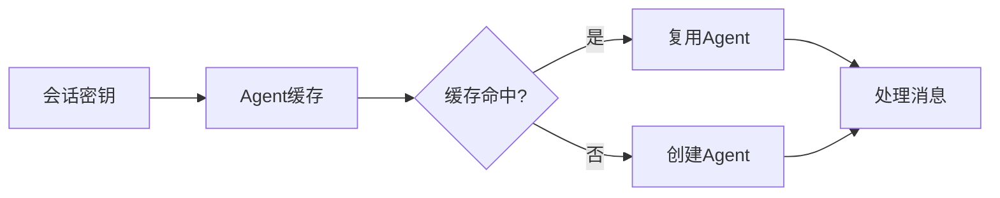

# Hermes Agent 流程图文档索引

## 📊 文档概述

本文档集包含了 Hermes Agent 从用户输入到响应返回的完整流程分析，通过多个维度的流程图展示系统的架构设计和执行机制。

## 🎯 文档结构

### 1. [15-message-processing-flow-swimlane-diagram.md](./15-message-processing-flow-swimlane-diagram.md)
**主流程泳道图**

- **7个主要阶段**: 从用户输入到持久化的完整流程
- **跨平台展示**: 飞书消息和TUI命令的并行处理
- **组件级别**: 展示各个关键组件的职责和交互
- **适合**: 理解整体架构和系统边界

**包含内容**:
- 飞书消息处理完整流程
- TUI命令处理完整流程  
- 平台适配器层设计
- Gateway网关机制
- 会话管理策略
- Agent内核执行
- 提示词构建过程
- 工具执行循环
- 响应格式化
- 持久化和维护

### 2. [16-technical-execution-flow-diagram.md](./16-technical-execution-flow-diagram.md)
**技术执行流程详解**

- **代码级别**: 具体的函数调用链和数据结构
- **飞书消息**: 详细的技术实现路径
- **TUI命令**: 完整的执行逻辑
- **适合**: 开发者理解和代码实现

**包含内容**:
- 飞书消息处理详细流程图
- TUI命令处理详细流程图
- 关键函数调用链
- MessageEvent数据结构
- 会话状态转换
- 并发处理机制
- 错误处理和恢复
- 性能优化策略
- 监控和可观测性

### 3. [17-user-interaction-scenarios.md](./17-user-interaction-scenarios.md)
**实际交互场景示例**

- **4个实际场景**: 真实用户使用案例
- **平台特性**: 飞书vs TUI的功能对比
- **用户体验**: 优化建议和最佳实践
- **适合**: 产品经理和用户体验设计

**包含场景**:
1. **飞书代码咨询**: 开发者询问Python代码问题
2. **TUI系统管理**: 系统管理员执行磁盘检查
3. **跨会话上下文**: 飞书用户的历史对话召回
4. **技能系统使用**: DevOps工程师的自动化部署

### 4. [18-code-navigation-guide.md](./18-code-navigation-guide.md)
**代码导航和查找指南**

- **文件位置**: 具体的文件路径和函数名
- **调用链追踪**: 完整的函数调用路径
- **快速查找**: 按功能和问题定位代码
- **适合**: 开发者代码理解和修改

**包含内容**:
- 主要目录结构说明
- 按功能查找代码
- 飞书消息处理代码路径
- TUI命令处理代码路径
- 关键数据结构说明
- 调试和日志查找指南
- 修改和扩展指南

## 🔄 流程图对比

### 按复杂度分类

| 文档 | 复杂度 | 目标读者 | 细节程度 |
|------|--------|----------|----------|
| 15-主流程泳道图 | ⭐⭐⭐ | 架构师、产品经理 | 系统级交互 |
| 16-技术执行流程 | ⭐⭐⭐⭐⭐ | 开发者、实现者 | 代码级实现 |
| 17-交互场景示例 | ⭐⭐ | 用户、测试者 | 实际使用案例 |
| 18-代码导航指南 | ⭐⭐⭐⭐ | 开发者、维护者 | 代码定位 |

### 按关注点分类

| 文档 | 主要关注点 | 涵盖范围 |
|------|------------|----------|
| 15-主流程泳道图 | 架构设计 | 所有入口的通用流程 |
| 16-技术执行流程 | 实现细节 | 飞书和TUI的具体实现 |
| 17-交互场景示例 | 用户体验 | 实际使用场景和体验优化 |
| 18-代码导航指南 | 代码位置 | 文件路径和函数名 |

## 🚀 快速导航

### 按角色查找

**架构师/技术负责人**:
1. 先看 [15-message-processing-flow-swimlane-diagram.md](./15-message-processing-flow-swimlane-diagram.md) 了解整体架构
2. 再看 [16-technical-execution-flow-diagram.md](./16-technical-execution-flow-diagram.md) 理解技术实现

**开发者**:
1. 直接看 [16-technical-execution-flow-diagram.md](./16-technical-execution-flow-diagram.md) 了解实现细节
2. 参考 [15-message-processing-flow-swimlane-diagram.md](./15-message-processing-flow-swimlane-diagram.md) 理解系统边界
3. 使用 [18-code-navigation-guide.md](./18-code-navigation-guide.md) 快速定位代码

**产品经理/用户**:
1. 看 [17-user-interaction-scenarios.md](./17-user-interaction-scenarios.md) 了解使用场景
2. 浏览 [15-message-processing-flow-swimlane-diagram.md](./15-message-processing-flow-swimlane-diagram.md) 了解系统能力

### 按问题查找

**"消息如何从飞书到达Agent?"**
- → [15-message-processing-flow-swimlane-diagram.md](./15-message-processing-flow-swimlane-diagram.md) 阶段1-3
- → [16-technical-execution-flow-diagram.md](./16-technical-execution-flow-diagram.md) 飞书消息处理详细流程
- → [18-code-navigation-guide.md](./18-code-navigation-guide.md) 飞书消息处理代码路径

**"TUI命令执行和飞书有什么不同?"**
- → [15-message-processing-flow-swimlane-diagram.md](./15-message-processing-flow-swimlane-diagram.md) 对比两个入口
- → [17-user-interaction-scenarios.md](./17-user-interaction-scenarios.md) 平台特性对比
- → [18-code-navigation-guide.md](./18-code-navigation-guide.md) 代码路径对比

**"Agent如何决定使用哪个工具?"**
- → [15-message-processing-flow-swimlane-diagram.md](./15-message-processing-flow-swimlane-diagram.md) 阶段5
- → [16-technical-execution-flow-diagram.md](./16-technical-execution-flow-diagram.md) 工具执行循环
- → [18-code-navigation-guide.md](./18-code-navigation-guide.md) 工具执行代码查找

**"系统提示是如何构建的?"**
- → [15-message-processing-flow-swimlane-diagram.md](./15-message-processing-flow-swimlane-diagram.md) 阶段4
- → [16-technical-execution-flow-diagram.md](./16-technical-execution-flow-diagram.md) 提示词构建调用链
- → [18-code-navigation-guide.md](./18-code-navigation-guide.md) 提示词构建器代码位置

**"如何处理多个用户同时使用?"**
- → [16-technical-execution-flow-diagram.md](./16-technical-execution-flow-diagram.md) 并发处理机制
- → [17-user-interaction-scenarios.md](./17-user-interaction-scenarios.md) 性能对比分析
- → [18-code-navigation-guide.md](./18-code-navigation-guide.md) 会话管理代码

**"我该从哪里开始阅读代码?"**
- → [18-code-navigation-guide.md](./18-code-navigation-guide.md) 代码阅读路径建议
- → [15-message-processing-flow-swimlane-diagram.md](./15-message-processing-flow-swimlane-diagram.md) 系统架构概览
- → [16-technical-execution-flow-diagram.md](./16-technical-execution-flow-diagram.md) 技术实现细节

**"如何找到具体的函数实现?"**
- → [18-code-navigation-guide.md](./18-code-navigation-guide.md) 快速查找指南
- → [16-technical-execution-flow-diagram.md](./16-technical-execution-flow-diagram.md) 函数调用链

**"如何调试和优化性能?"**
- → [16-technical-execution-flow-diagram.md](./16-technical-execution-flow-diagram.md) 性能优化策略
- → [18-code-navigation-guide.md](./18-code-navigation-guide.md) 调试日志位置

## 🔧 技术实现要点

### 核心架构原则

1. **统一抽象**: 所有平台消息转换为 `MessageEvent`
2. **分层处理**: 平台层 → 网关层 → 会话层 → Agent层
3. **智能缓存**: Agent缓存、提示词缓存、连接池化
4. **错误恢复**: 平台重连、工具重试、优雅降级
5. **可观测性**: 详细日志、性能指标、使用统计

### 关键设计模式

**消息处理模式**:

**会话管理模式**:

## 📈 性能特征

### 响应时间对比

| 入口类型 | 平均响应时间 | 主要延迟来源 |
|---------|-------------|-------------|
| 飞书消息 | 2-5秒 | 平台网络、媒体处理 |
| TUI命令 | 1-3秒 | 直接调用、无网络延迟 |
| 定时任务 | 1-2秒 | 无用户交互延迟 |

### 并发能力对比

| 入口类型 | 并发能力 | 限制因素 |
|---------|---------|---------|
| 飞书消息 | 100+并发会话 | 网络带宽、API限制 |
| TUI命令 | 单用户顺序 | 终端界面限制 |
| 定时任务 | 10+并行任务 | 系统资源 |

## 🎨 使用建议

### 飞书平台最佳场景

- ✅ **团队协作**: 多人讨论和决策
- ✅ **文件操作**: 代码审查、文档编辑
- ✅ **异步任务**: 不需要立即响应的请求
- ✅ **媒体交互**: 图片、视频处理
- ✅ **移动使用**: 随时随地的访问

### TUI界面最佳场景

- ✅ **快速命令**: 简单的查询和操作
- ✅ **系统管理**: 服务器维护和监控
- ✅ **开发调试**: 代码测试和问题诊断
- ✅ **批处理**: 大量文件的自动化处理
- ✅ **低延迟需求**: 需要即时响应的任务

### 混合使用策略

1. **日常交互**: 使用飞书平台进行沟通
2. **快速操作**: 使用TUI执行简单命令
3. **复杂任务**: 飞书启动，TUI监控
4. **定时任务**: 通过cron调度，飞书接收结果

## 🔍 故障处理指南

### 常见问题定位

**"飞书消息没有响应"**
1. 检查 [15-message-processing-flow-swimlane-diagram.md](./15-message-processing-flow-swimlane-diagram.md) 阶段1-3（接收与路由）
2. 参考 [18-code-navigation-guide.md](./18-code-navigation-guide.md) 飞书消息处理代码路径
3. 检查 `gateway/platforms/feishu.py:FeishuAdapter._handle_message()` 是否正常

**"TUI命令执行错误"**
1. 检查 [15-message-processing-flow-swimlane-diagram.md](./15-message-processing-flow-swimlane-diagram.md) TUI处理流程
2. 参考 [17-user-interaction-scenarios.md](./17-user-interaction-scenarios.md) TUI故障处理
3. 参考 [18-code-navigation-guide.md](./18-code-navigation-guide.md) TUI命令处理代码路径

**"响应速度慢"**
1. 查看 [16-technical-execution-flow-diagram.md](./16-technical-execution-flow-diagram.md) 性能优化策略
2. 检查 [18-code-navigation-guide.md](./18-code-navigation-guide.md) 中的性能监控点
3. 分析Agent缓存命中率和LLM响应时间

**"找不到某个功能的代码"**
1. 使用 [18-code-navigation-guide.md](./18-code-navigation-guide.md) 按功能查找代码
2. 参考相应的技术执行流程图定位代码位置
3. 使用IDE的搜索功能在相关文件中查找函数名

## 📚 相关文档

### 流程图文档
- [15-message-processing-flow-swimlane-diagram.md](./15-message-processing-flow-swimlane-diagram.md) - 主流程泳道图（含代码位置）
- [16-technical-execution-flow-diagram.md](./16-technical-execution-flow-diagram.md) - 技术执行流程（含代码位置）
- [17-user-interaction-scenarios.md](./17-user-interaction-scenarios.md) - 实际交互场景示例
- [18-code-navigation-guide.md](./18-code-navigation-guide.md) - 代码导航和查找指南

### 核心架构文档
- [01-overall-architecture-and-directory-structure.md](./01-overall-architecture-and-directory-structure.md)
- [02-agent-loop-and-execution-orchestration.md](./02-agent-loop-and-execution-orchestration.md)

### Session 和会话管理
- [21-session-concepts-and-architecture.md](./21-session-concepts-and-architecture.md) - Session 概念与架构详解（新增）
- [05-session-memory-and-cross-session-recall.md](./05-session-memory-and-cross-session-recall.md) - Session 存储和记忆管理

### 产品表面文档
- [07-product-surfaces-gateway-tui-acp-cron-and-kanban.md](./07-product-surfaces-gateway-tui-acp-cron-and-kanban.md)

### 功能特性文档
- [04-tool-runtime-and-capability-system.md](./04-tool-runtime-and-capability-system.md)
- [25-context-layer-relationship-diagram.md](./25-context-layer-relationship-diagram.md) - Context 分层关系图

### 中文提示词文档
- [agent/prompt_builder_cn.py](../agent/prompt_builder_cn.py)
- [agent/PROMPT_BUILDER_CN_README.md](../agent/PROMPT_BUILDER_CN_README.md)

## 🛠️ 维护指南

### 更新流程图

当系统架构发生变化时，按以下步骤更新流程图：

1. **识别变化**: 确定哪些组件或流程受到影响
2. **选择文档**: 决定需要更新哪个流程图文档
3. **更新图表**: 修改相应的Mermaid图表
4. **测试验证**: 确保图表反映实际实现
5. **交叉引用**: 更新相关文档的链接

### 添加新场景

要添加新的用户交互场景：

1. **创建场景**: 在 [17-user-interaction-scenarios.md](./17-user-interaction-scenarios.md) 中添加
2. **绘制流程**: 使用Mermaid创建场景流程图
3. **说明特性**: 描述平台特性和用户体验
4. **更新索引**: 在本文档中添加索引条目

## 📞 联系和反馈

如有疑问或建议，请参考：
- 项目主文档: [README.zh-CN.md](../README.zh-CN.md)
- 贡献指南: [CONTRIBUTING.md](../CONTRIBUTING.md)
- 问题报告: [GitHub Issues](https://github.com/NousResearch/hermes-agent/issues)

---

**文档版本**: 1.0  
**最后更新**: 2025-01-16  
**维护者**: Hermes Agent 开发团队
