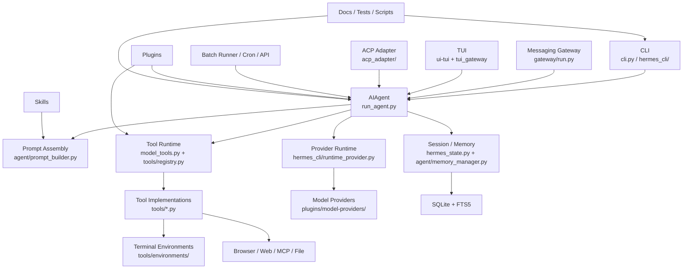

# Hermes Agent 调研 01：整体架构图与目录结构

## 1. 这篇文档回答什么问题

这一篇只做“入门定向”，解决四个问题：

1. Hermes 整体上是一套什么样的系统。
2. 系统由哪些大模块组成，它们之间如何协作。
3. 目录结构应该怎么读，哪些目录最重要。
4. 如果把它当成通用 AI Agent 案例，第一轮阅读应该先看哪里。

这篇文档不深入讲 Agent loop、Prompt、Tools、Memory、Plugin 的细节，那些会在后续专题里展开。

---

## 2. 一句话架构判断

Hermes 不是“一个会调工具的聊天脚本”，而是一套围绕 `AIAgent` 核心构建的 Agent 平台。

它的架构特征很明显：

- 多入口：CLI、TUI、消息网关、ACP、Batch、Web/API。
- 单核心：不同入口最终都尽量复用 `run_agent.py` 中的 `AIAgent`。
- 强工具化：工具系统不是附属能力，而是核心运行时的一部分。
- 强状态化：有 SQLite 会话存储、跨会话检索、长期记忆、用户画像。
- 强扩展性：Provider、Plugin、Skill、MCP、Context Engine 都是显式扩展面。
- 明显产品化：不仅能“跑通一次”，还考虑了调度、安全、日志、配置、平台接入和持续运行。

如果用一句更工程化的话说，Hermes 像是一个“带多种外设和扩展槽的 Agent 操作系统雏形”。

---

## 3. 总体架构图

下面这张图更适合学习时建立脑图：



可以把它理解成四层：

- 入口层：用户从哪里接入 Hermes。
- 编排层：`AIAgent` 负责一次完整 Agent 执行。
- 运行时层：Prompt、Provider、Tool、Session/Memory 等核心子系统。
- 扩展层：Plugins、Skills、MCP、Providers、Platform adapters。

---

## 4. 系统分层理解

### 4.1 入口层

Hermes 有很多入口，但它们不是各写一套 Agent 逻辑，而是尽量汇聚到同一个执行核心。

主要入口：

- `cli.py`：经典交互式 CLI。
- `hermes_cli/main.py`：`hermes` 命令总入口，负责子命令分发。
- `gateway/run.py`：消息平台网关主入口。
- `tui_gateway/` + `ui-tui/`：TUI 的 Python 后端和 React Ink 前端。
- `acp_adapter/`：给 VS Code / Zed / JetBrains 的 ACP 接口。
- `batch_runner.py`：批处理与轨迹生成。
- `cron/`：定时 Agent 任务调度。

学习上最重要的理解是：

- `hermes_cli/main.py` 更像“命令行产品入口”。
- `cli.py` 更像“交互式聊天前端”。
- `run_agent.py` 才是“Agent 执行内核”。

### 4.2 编排层

编排层几乎集中在 `run_agent.py`。

`AIAgent` 承担的是：

- 接受用户输入和历史上下文。
- 组装 Prompt。
- 解析当前模型与 Provider 的运行方式。
- 发起模型调用。
- 处理 tool call 循环。
- 写入状态、记忆和日志。
- 处理中断、重试、压缩和 fallback。

所以如果你把 Hermes 看成一个“操作系统”，`AIAgent` 就像内核的主调度器。

### 4.3 运行时层

Hermes 的核心运行时主要由四块构成：

- Prompt Runtime：`agent/prompt_builder.py`、`agent/prompt_caching.py`、`agent/context_compressor.py`
- Provider Runtime：`hermes_cli/runtime_provider.py`、`agent/transports/`、`plugins/model-providers/`
- Tool Runtime：`model_tools.py`、`toolsets.py`、`tools/registry.py`、`tools/*.py`
- State Runtime：`hermes_state.py`、`agent/memory_manager.py`、`tools/session_search_tool.py`

这四块正好对应一个通用 Agent 最常见的四个问题：

- 要给模型什么上下文。
- 通过什么接口和模型交互。
- 模型如何调用外部能力。
- 如何在多轮和跨会话中保持状态。

### 4.4 扩展层

Hermes 的扩展面非常多，而且是分层设计的。

主要扩展点：

- Plugins：普通插件，可注册 hooks、tools、CLI commands。
- Model Providers：模型提供方扩展。
- Memory Providers：记忆后端扩展。
- Context Engines：上下文管理扩展。
- Skills：任务级知识与工作流说明。
- MCP：外部工具协议接入。
- Gateway Platforms：消息平台适配器。

这说明 Hermes 的目标不是“做一组固定能力”，而是构建一个可以继续生长的 Agent 平台。

---

## 5. 顶层目录怎么读

先看顶层目录时，不建议一股脑全扫。更好的方式是先按职责分组。

### 5.1 第一组：真正的核心目录

这些目录决定 Hermes 能不能作为一个通用 Agent 跑起来：

- `run_agent.py`
- `model_tools.py`
- `toolsets.py`
- `agent/`
- `tools/`
- `hermes_state.py`
- `hermes_cli/`

这组目录基本覆盖了编排、工具、Prompt、Provider、配置和状态。

### 5.2 第二组：产品接入层

这些目录决定 Hermes 能以哪些形态对外提供能力：

- `gateway/`
- `acp_adapter/`
- `ui-tui/`
- `tui_gateway/`
- `web/`
- `cron/`
- `batch_runner.py`

如果你是从“产品形态”角度研究 Agent，这组很重要；如果你先关心“Agent 为什么能跑”，这组可以稍后看。

### 5.3 第三组：扩展与生态

这些目录体现 Hermes 的平台化能力：

- `plugins/`
- `skills/`
- `optional-skills/`
- `providers/`

其中有一个容易混淆的点：

- `plugins/model-providers/` 是现在更重要的 Provider 扩展路径。
- 顶层 `providers/` 更像兼容层或基础支持，不是主要扩展面。

### 5.4 第四组：工程支持与治理

这些目录不是 Agent 核心，但决定项目是否可维护：

- `tests/`
- `scripts/`
- `website/`
- `.github/`
- `nix/`
- `packaging/`

如果你的目标是“学习怎么做一个长期维护的 Agent 开源项目”，这组也很值得看。

---

## 6. 最关键的目录地图

### 6.1 `agent/`：Agent 内脏层

`agent/` 不是入口，而是内核周边的能力收纳层。这里面最值得先知道的几个模块：

- `prompt_builder.py`：系统 Prompt 组装中心。
- `context_compressor.py`：上下文过长时如何压缩。
- `memory_manager.py`：记忆协调层。
- `memory_provider.py`：记忆 Provider 抽象。
- `model_metadata.py`：模型上下文长度、token 估算、能力元数据。
- `retry_utils.py`、`error_classifier.py`：错误分类和重试/fallback 支撑。
- `display.py`：CLI/TUI 交互展示支撑。
- `skill_commands.py`、`skill_utils.py`：技能系统接入。
- `transports/`：不同 API 模式与协议的传输适配。

理解上可以把 `agent/` 看成：

- `run_agent.py` 太大，放不下的“可复用 Agent 内部模块”。

### 6.2 `hermes_cli/`：CLI 产品层

`hermes_cli/` 的职责不是替代 `AIAgent`，而是把 Hermes 包装成一个完整可用的命令行产品。

里面最关键的是：

- `main.py`：`hermes` 总入口。
- `config.py`：默认配置、配置迁移、环境变量元数据。
- `runtime_provider.py`：统一 Provider 运行时解析。
- `commands.py`：slash command 注册中心。
- `plugins.py`：普通插件发现与装载。
- `setup.py`：安装/初始化向导。
- `tools_config.py`、`skills_config.py`：工具和技能配置管理。
- `web_server.py`：Web 与 Dashboard 相关服务。
- `pty_bridge.py`：Web Dashboard 复用 TUI 的桥接层。

如果说 `run_agent.py` 是“引擎”，`hermes_cli/` 就更像“整车车身和中控系统”。

### 6.3 `tools/`：工具运行时与工具实现

这是 Hermes 最像“Agent 能力底座”的目录。

关键文件：

- `registry.py`：工具注册表。
- `terminal_tool.py`：终端工具中枢。
- `file_tools.py`：文件读写、patch、搜索。
- `browser_tool.py`：浏览器自动化。
- `mcp_tool.py`：MCP 接入。
- `code_execution_tool.py`：代码执行沙箱。
- `delegate_tool.py`：子代理委托。
- `approval.py`：危险命令审批。
- `path_security.py`：路径越权保护。
- `environments/`：终端后端实现。

你可以把 `tools/` 理解成 Hermes 的“系统调用层”。

### 6.4 `gateway/`：多平台消息网关

这个目录说明 Hermes 从一开始就不是只能在终端里使用。

关键结构：

- `run.py`：网关主循环。
- `session.py`：网关会话存储与恢复。
- `delivery.py`：消息回发。
- `pairing.py`：私聊配对授权。
- `hooks.py`：网关钩子机制。
- `platforms/`：各个平台 adapter。

`gateway/platforms/` 本身就体现了不错的抽象能力，因为同一套 Agent 要对接 Telegram、Discord、Slack、Email、Feishu、WeCom、WhatsApp、Signal 等不同交互模型。

### 6.5 `plugins/`：平台化扩展面

`plugins/` 不是一个单一机制，而是多个扩展面并存：

- `model-providers/`：模型提供方插件。
- `memory/`：记忆后端插件。
- `context_engine/`：上下文引擎插件。
- `kanban/`：多 Agent 协作插件。
- `image_gen/`、`video_gen/`：媒体生成 Provider。
- `platforms/`：额外的平台能力。
- 其他如 `observability/`、`spotify/`、`google_meet/` 等。

这说明 Hermes 的“扩展”不只是加几个工具，而是允许替换部分系统组件。

### 6.6 `skills/` 与 `optional-skills/`

这是 Hermes 很有辨识度的一部分。

区别是：

- `skills/`：内置可直接使用的技能。
- `optional-skills/`：官方随仓库分发，但默认不启用的重型或小众技能。

从架构上说，Skills 不属于“核心运行时代码”，但它们极大影响 Hermes 的任务表现和产品体验。

### 6.7 `ui-tui/` + `tui_gateway/`

这组目录很好地体现了 Hermes 的跨技术栈设计：

- `ui-tui/`：Node/TypeScript/Ink 负责界面渲染。
- `tui_gateway/`：Python 负责会话、工具、命令和 Agent 执行。

它们通过 stdio JSON-RPC 对接，而不是把整个 Agent 逻辑搬到前端。

这是一个很典型的“前后端职责清晰，但共享同一执行核心”的设计。

---

## 7. 关键依赖方向

如果只想用最少的依赖关系理解整个仓库，可以抓住这条主链：

```text
tools/registry.py
  ↑
tools/*.py
  ↑
model_tools.py
  ↑
run_agent.py
  ↑
cli.py / gateway/run.py / acp_adapter / batch_runner / cron
```

这条链很好地说明了 Hermes 的设计哲学：

- 工具是底层注册对象。
- `model_tools.py` 负责把工具组织成运行时可用能力。
- `run_agent.py` 负责把这些能力纳入 Agent loop。
- 各种产品入口只是在不同场景里驱动同一个 Agent 核心。

这条依赖方向也是初学者最值得抓住的主线。

---

## 8. 从“通用 AI Agent 案例”角度，哪些部分最值得重点关注

如果你的目标是学习“怎么设计一个通用 Agent 框架”，我建议优先关注以下结构意义：

### 8.1 `run_agent.py` 是统一编排核心

很多项目把 CLI 逻辑、工具逻辑、Provider 逻辑散在各处；Hermes 把它们尽量收束到一个主执行核心里。这个设计对可复用性非常重要。

### 8.2 `tools/` 不是附庸，而是一级系统

Hermes 的工具系统不是“顺手加几个函数”，而是有注册、分组、可用性检测、审批、安全和环境后端的完整运行时，这非常值得学。

### 8.3 `hermes_state.py` 说明它是状态化 Agent，而不是一次性助手

有 SQLite、FTS5、session lineage、跨会话搜索，就意味着 Hermes 解决的是“长期使用中的 Agent”问题。

### 8.4 `gateway/` 和 `ui-tui/` 说明它是产品架构，不只是研究脚本

同一个 Agent 内核要同时服务终端、消息平台、IDE 和 Web，这比单入口 Agent 更接近真实产品。

### 8.5 `plugins/` 和 `skills/` 说明它在追求平台化和可演化

一个通用 Agent 框架不能只靠核心代码成长，必须有扩展机制。Hermes 在这一点上已经形成比较完整的雏形。

---

## 9. 初学者阅读顺序

建议的第一轮阅读顺序：

1. [website/docs/developer-guide/architecture.md](/D:/dev/opensource/hermes-agent/website/docs/developer-guide/architecture.md)
2. [AGENTS.md](/D:/dev/opensource/hermes-agent/AGENTS.md)
3. [hermes_cli/main.py](/D:/dev/opensource/hermes-agent/hermes_cli/main.py)
4. [run_agent.py](/D:/dev/opensource/hermes-agent/run_agent.py)
5. [model_tools.py](/D:/dev/opensource/hermes-agent/model_tools.py)
6. [toolsets.py](/D:/dev/opensource/hermes-agent/toolsets.py)
7. [tools/registry.py](/D:/dev/opensource/hermes-agent/tools/registry.py)
8. [hermes_state.py](/D:/dev/opensource/hermes-agent/hermes_state.py)
9. [gateway/run.py](/D:/dev/opensource/hermes-agent/gateway/run.py)
10. [tui_gateway/server.py](/D:/dev/opensource/hermes-agent/tui_gateway/server.py)

背后的思路是：

- 先知道系统地图。
- 再知道命令入口和核心执行入口。
- 然后知道工具系统如何接到 Agent 上。
- 最后再看状态存储和多入口接入。

---

## 10. 第一轮阅读时可以暂时不深挖的部分

为了避免一开始信息过载，下面这些目录可以先知道存在，但不必马上深挖：

- `optional-skills/`
- `web/`
- `nix/`
- `packaging/`
- `docs/`
- `datagen-config-examples/`
- 各类单独的 provider/plugin 具体实现

第一轮先把“主干”走通，比横向扫所有分支更重要。

---

## 11. 这一步调研后的结论

Hermes 的整体架构已经明显超出“单文件 Agent Demo”的范畴。它的主干结构可以概括为：

- 多入口接入。
- 单核心编排。
- 工具运行时为中心。
- 会话和记忆做状态底座。
- 插件和技能做扩展面。
- 文档、测试、配置和网关支撑产品化。

从学习价值看，这个仓库最适合作为下面这类问题的案例：

- 一个通用 Agent 内核应该如何组织。
- 不同交互形态如何共享同一套 Agent 核心。
- 工具系统如何从“函数集合”进化成“运行时系统”。
- 状态化 Agent 的存储和记忆层应该怎么落地。
- 一个 Agent 项目如何走向平台化和长期维护。

下一篇最自然的下钻方向，就是调研 `run_agent.py`，也就是“Agent 主循环与执行编排”。
