# Hermes Agent 消息处理流程泳道图

## 概述

本文档通过泳道图展示了 Hermes Agent 如何处理来自不同入口（飞书消息、TUI命令）的用户请求，并最终返回响应的完整流程，包含具体的文件路径和函数名。

## 架构入口

Hermes Agent 支持多种用户交互入口：

- **飞书消息**: 通过 `gateway/platforms/feishu.py` 适配器
- **TUI命令**: 通过 `hermes_cli/main.py` 命令行界面  
- **其他消息平台**: Telegram、Discord、Slack、WeCom等
- **定时任务**: 通过 `cron/scheduler.py` 调度器
- **编辑器集成**: 通过 `acp_adapter/` ACP协议服务器

## 主流程泳道图（含代码位置）

```mermaid
sequenceDiagram
    autonumber
    
    participant User as 👤 用户
    participant Feishu as 📱 飞书平台
    participant TUI as 💻 TUI界面
    participant Gateway as 🚪 Gateway网关
    participant Adapter as 🔌 平台适配器
    participant Session as 📋 会话管理
    participant Agent as 🤖 AIAgent内核
    participant Prompt as 📝 提示词构建器
    participant LLM as 🧠 LLM提供商
    participant Tools as 🔧 工具执行器
    participant Memory as 💾 持久化记忆
    participant Response as 📤 响应格式化
    
    rect rgb(230, 240, 255)
        Note over User,Response: 阶段1: 用户输入与接收
        User->>Feishu: 发送飞书消息
        User->>TUI: 输入TUI命令
        Note right of Feishu: 📁 gateway/platforms/feishu.py<br/>⚙️ FeishuAdapter.start_polling()
        Note right of TUI: 📁 hermes_cli/main.py<br/>⚙️ ChatCommand.run()
    end
    
    rect rgb(255, 245, 230)
        Note over User,Response: 阶段2: 平台适配与路由
        Feishu->>Adapter: 接收飞书事件
        TUI->>Adapter: 接收命令行输入
        
        Note right of Adapter: 📁 gateway/platforms/feishu.py<br/>⚙️ FeishuAdapter._handle_message()<br/>📁 hermes_cli/main.py<br/>⚙️ ChatCommand._create_message_event()
        
        Adapter->>Adapter: 解析平台特定格式
        Note right of Adapter: 📁 gateway/platforms/base.py<br/>⚙️ PlatformAdapter._create_message_event()
        
        Adapter->>Adapter: 转换为统一MessageEvent
        Note right of Adapter: 📁 gateway/session.py<br/>⚙️ @dataclass MessageEvent
        
        Adapter->>Gateway: 发送统一消息事件
        Note right of Adapter: 📁 gateway/run.py<br/>⚙️ GatewayRunner.queue_message()
    end
    
    rect rgb(240, 255, 240)
        Note over User,Response: 阶段3: 网关处理与会话管理
        Gateway->>Gateway: 解析会话密钥
        Note right of Gateway: 📁 gateway/run.py<br/>⚙️ GatewayRunner._parse_session_key()
        Note right of Gateway: 格式: agent:main:{platform}:{chat_type}:{chat_id}
        
        Gateway->>Session: 查找或创建会话
        Note right of Gateway: 📁 gateway/run.py<br/>⚙️ GatewayRunner._get_or_create_session()
        
        Session->>Session: 检查会话状态(活跃/中断/过期)
        Note right of Session: 📁 gateway/session.py<br/>⚙️ Session.get_status()
        
        Session->>Memory: 加载历史上下文
        Note right of Session: 📁 gateway/session.py<br/>⚙️ Session.load_history()
        Note right of Memory: 📁 agent/memory/<br/>⚙️ ConversationMemory.load_messages()
        
        Memory-->>Session: 返回对话历史
        Session->>Gateway: 返回会话句柄
    end
    
    rect rgb(255, 240, 245)
        Note over User,Response: 阶段4: 系统提示构建
        Gateway->>Agent: 调用处理方法
        Note right of Gateway: 📁 gateway/run.py<br/>⚙️ GatewayRunner._route_to_agent()
        Note right of Agent: 📁 run_agent.py<br/>⚙️ AIAgent.run_conversation()
        
        Agent->>Prompt: 构建系统提示
        Note right of Prompt: 📁 agent/prompt_builder.py<br/>⚙️ build_system_prompt()
        
        Prompt->>Prompt: 加载身份和规则
        Note right of Prompt: 📁 agent/prompt_builder.py<br/>⚙️ load_soul_md() → DEFAULT_AGENT_IDENTITY
        
        Prompt->>Prompt: 添加技能索引
        Note right of Prompt: 📁 agent/prompt_builder.py<br/>⚙️ build_skills_system_prompt()
        
        Prompt->>Prompt: 注入上下文文件
        Note right of Prompt: 📁 agent/prompt_builder.py<br/>⚙️ build_context_files_prompt()
        
        Prompt->>Prompt: 包含记忆指导
        Note right of Prompt: 📁 agent/prompt_builder.py<br/>⚙️ MEMORY_GUIDANCE
        
        Prompt->>Prompt: 添加平台特定提示
        Note right of Prompt: 📁 agent/prompt_builder.py<br/>⚙️ PLATFORM_HINTS[platform]
        Note right of Prompt: 飞书: PLATFORM_HINTS["feishu"]<br/>TUI: PLATFORM_HINTS["cli"]
        
        Prompt-->>Agent: 返回完整系统提示
    end
    
    rect rgb(255, 255, 230)
        Note over User,Response: 阶段5: LLM调用与工具执行
        Agent->>LLM: 发送聊天请求
        Note right of Agent: 📁 run_agent.py<br/>⚙️ AIAgent._call_llm_api()
        Note right of Agent: 📁 providers/<br/>⚙️ Provider.chat()
        Note right of Agent: 包含: 系统提示 + 用户消息 + 对话历史
        
        LLM-->>Agent: 返回AI响应
        Note right of Agent: 📁 run_agent.py<br/>⚙️ AIAgent._process_response()
        
        loop 工具执行循环
            Note right of Agent: 📁 run_agent.py<br/>⚙️ AIAgent._execute_tool_calls()
            
            alt AI请求工具调用
                Agent->>Tools: 解析工具调用参数
                Note right of Tools: 📁 tools/terminal_tool.py<br/>⚙️ terminal()<br/>📁 tools/file_tools.py<br/>⚙️ read_file()<br/>📁 tools/search.py<br/>⚙️ search_files()
                
                Tools->>Tools: 验证工具权限和可用性
                Note right of Tools: 📁 tools/file_tools.py<br/>⚙️ _check_file_access()<br/>📁 hermes_cli/tools_config.py<br/>⚙️ is_tool_enabled()
                
                Tools->>Tools: 执行具体工具操作
                Note right of Tools: 📁 tools/terminal_tool.py<br/>⚙️ execute_command()<br/>📁 tools/environments.py<br/>⚙️ get_environment().execute()
                
                Tools-->>Agent: 返回工具执行结果
                Note right of Agent: 📁 run_agent.py<br/>⚙️ AIAgent._handle_tool_result()
                
                Agent->>Memory: 保存重要发现到记忆
                Note right of Memory: 📁 agent/memory/<br/>⚙️ memory_tool.add()<br/>📁 agent/prompt_builder.py<br/>⚙️ MEMORY_GUIDANCE
                
                Agent->>LLM: 发送工具结果请求继续
                Note right of Agent: 📁 run_agent.py<br/>⚙️ AIAgent._continue_after_tool()
                LLM-->>Agent: 返回后续响应
            else AI完成响应
                Agent->>Agent: 标记响应完成
                Note right of Agent: 📁 run_agent.py<br/>⚙️ AIAgent._final_response()
            end
        end
    end
    
    rect rgb(240, 230, 255)
        Note over User,Response: 阶段6: 响应格式化与返回
        Agent->>Response: 格式化最终响应
        Note right of Response: 📁 gateway/delivery.py<br/>⚙️ format_response()
        Note right of Response: 📁 gateway/display_config.py<br/>⚙️ apply_display_rules()
        
        Response->>Response: 根据平台调整格式
        Note right of Response: 飞书: 📁 gateway/platforms/feishu.py<br/>⚙️ FeishuAdapter._format_response()<br/>TUI: 📁 hermes_cli/display.py<br/>⚙️ format_output()
        
        Note right of Response: 飞书: markdown渲染、媒体标签<br/>TUI: 纯文本、颜色输出
        
        Response->>Gateway: 返回格式化响应
        Note right of Gateway: 📁 gateway/run.py<br/>⚙️ GatewayRunner._send_response()
        
        Gateway->>Adapter: 转发响应到平台适配器
        Note right of Gateway: 📁 gateway/run.py<br/>⚙️ GatewayRunner._deliver_to_platform()
        
        alt 飞书平台
            Note right of Adapter: 📁 gateway/platforms/feishu.py<br/>⚙️ FeishuAdapter.send_message()
            Adapter->>Feishu: 发送飞书消息
            Note right of Feishu: 📁 gateway/platforms/feishu.py<br/>⚙️ client.message.send()
            Feishu->>User: 显示响应(含markdown、媒体)
        else TUI界面
            Note right of Adapter: 📁 hermes_cli/main.py<br/>⚙️ ChatCommand._display_response()
            Adapter->>TUI: 显示终端输出
            Note right of TUI: 📁 hermes_cli/display.py<br/>⚙️ print_rich_text()
            TUI->>User: 显示响应(纯文本/彩色)
        end
    end
    
    rect rgb(230, 255, 250)
        Note over User,Response: 阶段7: 持久化与清理
        Agent->>Session: 保存对话记录
        Note right of Session: 📁 gateway/session.py<br/>⚙️ Session.save_messages()
        Note right of Session: 📁 agent/memory/<br/>⚙️ ConversationMemory.add_messages()
        
        Session->>Memory: 更新会话统计
        Note right of Session: 📁 gateway/session.py<br/>⚙️ Session.update_stats()
        
        Session->>Session: 检查会话过期
        Note right of Session: 📁 gateway/run.py<br/>⚙️ GatewayRunner._session_expiry_watcher()
        
        Gateway->>Gateway: 执行后台维护
        Note right of Gateway: 📁 gateway/run.py<br/>⚙️ GatewayRunner._enforce_agent_cache_cap()
        Note right of Gateway: 清理过期会话<br/>释放Agent缓存<br/>更新使用统计
    end
```



## 核心组件说明（含代码位置）

### 1. 平台适配器层 (`gateway/platforms/`)

**职责**: 
- 接收平台特定的消息格式
- 处理平台认证和授权
- 转换为统一的 `MessageEvent`
- 格式化响应为平台特定格式

**关键文件和函数**:
```
gateway/platforms/
├── base.py              # 基类: PlatformAdapter
│   └── _create_message_event()   # 统一消息事件创建
├── feishu.py            # 飞书: FeishuAdapter
│   ├── start_polling()           # 启动轮询
│   ├── _handle_message()         # 处理消息
│   └── send_message()            # 发送响应
├── telegram.py          # Telegram: TelegramAdapter
│   └── handle_update()           # 处理更新
└── discord.py           # Discord: DiscordAdapter
    └── handle_message()          # 处理消息
```

### 2. Gateway网关 (`gateway/run.py`)

**职责**:
- 管理平台适配器生命周期
- 会话路由和负载均衡
- 消息队列和中断处理
- Agent缓存管理
- 后台维护任务

**关键类和函数**:
```
gateway/run.py:
├── GatewayRunner              # 网关主运行器
│   ├── start()                 # 启动网关
│   ├── _handle_message()       # 处理消息
│   ├── _get_or_create_session() # 会话管理
│   ├── _get_agent()            # Agent缓存
│   └── _enforce_agent_cache_cap() # 缓存清理
└── MessageEvent                # 统一消息事件
    └── @dataclass             # 消息数据结构
```

### 3. 会话管理 (`gateway/session.py`)

**职责**:
- 会话生命周期管理
- 历史上下文加载
- 中断和恢复处理
- 会话过期清理

**关键类和函数**:
```
gateway/session.py:
├── Session                     # 会话类
│   ├── __init__()              # 初始化会话
│   ├── load_history()          # 加载历史
│   ├── save_messages()         # 保存消息
│   └── get_status()            # 获取状态
└── session_key: str            # 会话密钥格式
    "agent:main:{platform}:{chat_type}:{chat_id}"
```

### 4. AIAgent内核 (`run_agent.py`)

**职责**:
- 对话循环管理
- 工具调用协调
- 错误处理和恢复
- 响应生成

**关键类和函数**:
```
run_agent.py:
├── AIAgent                     # Agent核心类
│   ├── __init__()              # 初始化
│   ├── run_conversation()      # 对话循环
│   ├── _call_llm_api()         # LLM调用
│   ├── _execute_tool_calls()   # 工具执行
│   └── _final_response()       # 最终响应
└── Message                     # 消息数据结构
    └── @dataclass             # 消息类
```

### 5. 提示词构建器 (`agent/prompt_builder.py`)

**职责**:
- 构建系统提示
- 技能索引生成
- 上下文文件加载
- 平台特定提示

**关键函数和常量**:
```
agent/prompt_builder.py:
├── build_system_prompt()       # 主构建函数
├── load_soul_md()             # SOUL.md加载
├── build_context_files_prompt() # 上下文文件
├── build_skills_system_prompt() # 技能索引
├── build_environment_hints()   # 环境提示
└── PLATFORM_HINTS              # 平台提示字典
    ├── "feishu": ...           # 飞书提示
    ├── "cli": ...              # TUI提示
    └── "telegram": ...         # Telegram提示
```

### 6. 工具执行器 (`tools/`)

**职责**:
- 工具权限验证
- 工具执行和结果处理
- 错误处理和重试
- 文件操作管理

**关键工具文件**:
```
tools/
├── terminal_tool.py           # 终端工具
│   └── terminal()             # 执行命令
├── file_tools.py              # 文件工具
│   ├── read_file()            # 读取文件
│   ├── write_file()           # 写入文件
│   └── search_files()          # 搜索文件
├── search.py                  # 搜索工具
│   ├── web_search()           # 网络搜索
│   └── search_files()         # 文件搜索
└── environments.py            # 环境管理
    └── get_environment()       # 获取环境
```

### 7. 持久化记忆 (`agent/memory/`)

**职责**:
- 跨会话记忆存储
- 用户偏好管理
- 技能和学习存储
- 会话历史管理

**关键组件**:
```
agent/memory/
├── conversation_memory.py     # 会话记忆
│   └── ConversationMemory     # 记忆类
├── memory_tool.py             # 记忆工具
│   └── memory()              # 记忆操作
└── session_search.py          # 会话搜索
    └── session_search()       # 搜索历史
```

## 代码快速查找指南

### 飞书消息处理代码路径


### TUI命令处理代码路径


### 按功能查找代码

| 功能 | 主要文件 | 关键函数 |
|------|---------|---------|
| 飞书消息接收 | `gateway/platforms/feishu.py` | `FeishuAdapter._handle_message()` |
| TUI命令解析 | `hermes_cli/main.py` | `ChatCommand._parse_input()` |
| 网关消息路由 | `gateway/run.py` | `GatewayRunner._handle_message()` |
| 会话管理 | `gateway/session.py` | `Session.load_history()` |
| Agent执行 | `run_agent.py` | `AIAgent.run_conversation()` |
| 提示词构建 | `agent/prompt_builder.py` | `build_system_prompt()` |
| 工具执行 | `tools/terminal_tool.py` | `terminal()` |
| 记忆管理 | `agent/memory/` | `ConversationMemory.add_messages()` |
| 响应格式化 | `gateway/delivery.py` | `format_response()` |

## 数据流转

### 输入数据流

```
用户输入 → 平台原始事件 → MessageEvent → Gateway路由 → 会话处理 → Agent执行
```

### 输出数据流

```
Agent响应 → 格式化处理 → 平台适配 → 平台特定格式 → 用户显示
```

### 状态数据流

```
会话状态 ← → 记忆存储 ← → Agent缓存 ← → 统计数据
```

## 关键设计决策

### 1. 统一消息模型

所有平台消息被转换为统一的 `MessageEvent`，包含：
- 用户标识
- 消息内容
- 媒体附件
- 平台元数据
- 会话上下文

### 2. 智能会话路由

使用结构化会话密钥实现：
- 精确的会话定位
- 高效的缓存利用
- 平台无关的会话管理

### 3. 分层架构

```
平台层 → 网关层 → 会话层 → Agent层 → 工具层
```

每层职责清晰，易于扩展和维护。

## 性能优化

### 1. Agent缓存
- LRU缓存策略
- 空闲超时清理
- 最大缓存限制

### 2. 提示词缓存
- 技能索引缓存
- 上下文文件缓存
- 平台提示缓存

### 3. 连接池化
- HTTP连接复用
- 平台适配器连接池
- 数据库连接池

## 错误处理

### 1. 平台连接错误
- 自动重连机制
- 降级处理策略
- 错误日志记录

### 2. 工具执行错误
- 超时处理
- 重试逻辑
- 错误信息格式化

### 3. 会话错误
- 会话恢复机制
- 状态一致性保证
- 优雅降级处理

## 扩展性设计

### 1. 新平台接入
- 继承 `PlatformAdapter` 基类
- 实现平台特定方法
- 注册到网关

### 2. 新工具添加
- 实现工具接口
- 添加权限控制
- 注册到工具集

### 3. 新技能集成
- 遵循技能格式规范
- 添加到技能目录
- 自动索引和加载

## 监控和可观测性

### 1. 使用统计
- Token使用量
- API调用次数
- 工具执行统计
- 会话活跃度

### 2. 性能监控
- 响应延迟
- 吞吐量
- 错误率
- 缓存命中率

### 3. 日志记录
- 结构化日志
- 分级日志记录
- 敏感信息脱敏
- 审计追踪

## 总结

Hermes Agent 的消息处理流程体现了良好的系统设计：

1. **分层架构**: 清晰的职责分离
2. **统一抽象**: 平台无关的核心处理
3. **智能缓存**: 优化性能和资源使用
4. **错误处理**: 健壮的异常处理机制
5. **可扩展性**: 易于添加新平台和功能

这种设计使得 Hermes Agent 能够支持多种交互方式，同时保持核心逻辑的一致性和可维护性。
