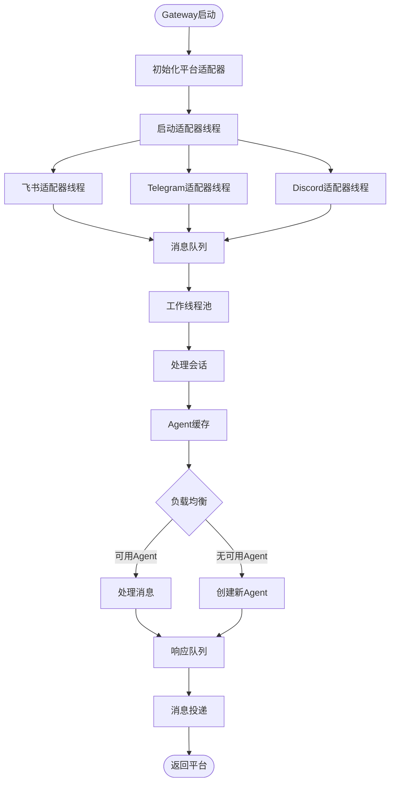
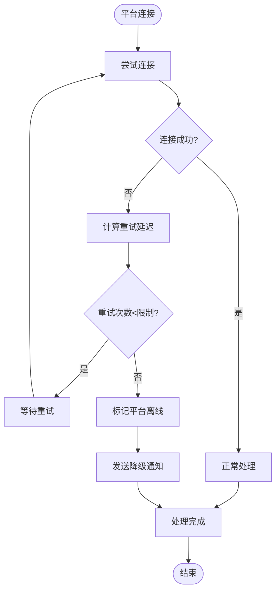

# Hermes Agent 技术执行流程详解

## 飞书消息处理详细流程（含代码位置）

```mermaid
flowchart TD
    Start([用户发送飞书消息]) --> FeishuRecv[飞书平台接收事件]
    FeishuRecv --> FeishuAdapter["📁 gateway/platforms/feishu.py<br/>⚙️ FeishuAdapter.start_polling"]

    FeishuAdapter --> ParseEvent{解析事件类型}
    Note right of ParseEvent: "📁 gateway/platforms/feishu.py<br/>⚙️ _handle_event"

    ParseEvent -->|消息事件| ParseMessage[解析消息内容]
    ParseEvent -->|事件回调| HandleCallback[处理事件回调]

    ParseMessage --> ExtractMedia{提取媒体文件}
    Note right of ExtractMedia: "📁 gateway/platforms/feishu.py<br/>⚙️ _extract_media_files"

    ExtractMedia -->|有媒体| DownloadMedia[下载媒体文件]
    Note right of DownloadMedia: "📁 gateway/platforms/feishu.py<br/>⚙️ _download_media"

    ExtractMedia -->|无媒体| CreateEvent
    DownloadMedia --> CreateEvent[创建MessageEvent]
    Note right of CreateEvent: "📁 gateway/platforms/base.py<br/>⚙️ _create_message_event"

    CreateEvent --> GatewaySend[发送到Gateway]
    Note right of GatewaySend: "📁 gateway/platforms/feishu.py<br/>⚙️ gateway.queue_message"

    GatewaySend --> GatewayRunner["📁 gateway/run.py<br/>⚙️ GatewayRunner._handle_message"]

    GatewayRunner --> ParseSessionKey[解析会话密钥]
    Note right of ParseSessionKey: "📁 gateway/run.py<br/>⚙️ _parse_session_key"

    ParseSessionKey --> GetSession[获取/创建会话]
    Note right of GetSession: "📁 gateway/run.py<br/>⚙️ _get_or_create_session"

    GetSession --> LoadHistory[加载历史上下文]
    Note right of LoadHistory: "📁 gateway/session.py<br/>⚙️ Session.load_history"

    LoadHistory --> AgentCache{检查Agent缓存}
    Note right of AgentCache: "📁 gateway/run.py<br/>⚙️ _get_agent"

    AgentCache -->|缓存命中| UseCachedAgent[使用缓存的AIAgent]
    Note right of UseCachedAgent: "📁 gateway/run.py<br/>⚙️ agent_cache.get"

    AgentCache -->|缓存未命中| CreateNewAgent[创建新的AIAgent]
    Note right of CreateNewAgent: "📁 run_agent.py<br/>⚙️ AIAgent.__init__"

    UseCachedAgent --> BuildPrompt[构建系统提示]
    CreateNewAgent --> BuildPrompt

    BuildPrompt --> LoadIdentity[加载身份提示]
    Note right of LoadIdentity: "📁 agent/prompt_builder.py<br/>⚙️ load_soul_md"

    LoadIdentity --> LoadSkills[加载技能索引]
    Note right of LoadSkills: "📁 agent/prompt_builder.py<br/>⚙️ build_skills_system_prompt"

    LoadSkills --> LoadContext[加载上下文文件]
    Note right of LoadContext: "📁 agent/prompt_builder.py<br/>⚙️ build_context_files_prompt"

    LoadContext --> LoadMemory[加载持久记忆]
    Note right of LoadMemory: "📁 agent/memory/<br/>⚙️ ConversationMemory.load_messages"

    LoadMemory --> AddPlatformHint[添加平台提示]
    Note right of AddPlatformHint: "📁 agent/prompt_builder.py<br/>⚙️ PLATFORM_HINTS feishu"

    AddPlatformHint --> CallLLM[调用LLM API]
    Note right of CallLLM: "📁 run_agent.py<br/>⚙️ AIAgent._call_llm_api"

    CallLLM --> LLMResponse[接收LLM响应]
    Note right of LLMResponse: "📁 providers/<br/>⚙️ Provider.chat"

    LLMResponse --> CheckTools{检查工具调用}
    Note right of CheckTools: "📁 run_agent.py<br/>⚙️ _process_tool_calls"

    CheckTools -->|有工具调用| ExecuteTools[执行工具]
    CheckTools -->|无工具调用| FormatResponse

    ExecuteTools --> ToolLoop{工具执行循环}
    Note right of ToolLoop: "📁 run_agent.py<br/>⚙️ _execute_tool_calls"

    ToolLoop -->|继续| ExecuteTools
    ToolLoop -->|完成| FormatResponse

    FormatResponse --> PlatformFormat[格式化为飞书格式]
    Note right of PlatformFormat: "📁 gateway/delivery.py<br/>⚙️ format_response"

    PlatformFormat --> SendFeishu[发送飞书消息]
    Note right of SendFeishu: "📁 gateway/platforms/feishu.py<br/>⚙️ send_message"

    SendFeishu --> SaveSession[保存会话记录]
    Note right of SaveSession: "📁 gateway/session.py<br/>⚙️ Session.save_messages"

    SaveSession --> End([返回用户响应])
```

## TUI命令处理详细流程（含代码位置）

```mermaid
flowchart TD
    Start([用户输入TUI命令]) --> TUIRecv[TUI界面接收输入]
    Note right of TUIRecv: "📁 hermes_cli/main.py<br/>⚙️ ChatCommand.run"

    TUIRecv --> ParseCommand[解析命令和参数]
    Note right of ParseCommand: "📁 hermes_cli/main.py<br/>⚙️ ChatCommand._parse_input"

    ParseCommand --> CommandType{命令类型}
    Note right of CommandType: "📁 hermes_cli/main.py<br/>⚙️ _route_command"

    CommandType -->|聊天命令| ChatProcess[聊天处理]
    Note right of ChatProcess: "📁 hermes_cli/main.py<br/>⚙️ ChatCommand._handle_user_message"

    CommandType -->|配置命令| ConfigProcess[配置处理]
    Note right of ConfigProcess: "📁 hermes_cli/commands/config.py<br/>⚙️ ConfigCommand.run"

    CommandType -->|网关命令| GatewayProcess[网关处理]
    Note right of GatewayProcess: "📁 hermes_cli/commands/gateway.py<br/>⚙️ GatewayCommand.run"

    ChatProcess --> CreateMessageEvent[创建MessageEvent]
    Note right of CreateMessageEvent: "📁 hermes_cli/main.py<br/>⚙️ _create_message_event"

    ConfigProcess --> ExecuteConfig[执行配置操作]
    Note right of ExecuteConfig: "📁 hermes_cli/config.py<br/>⚙️ cfg_set, cfg_get"

    GatewayProcess --> ControlGateway[控制网关服务]
    Note right of ControlGateway: "📁 gateway/run.py<br/>⚙️ start_gateway, stop_gateway"

    CreateMessageEvent --> DirectAgent[直接调用AIAgent]
    Note right of DirectAgent: "📁 run_agent.py<br/>⚙️ AIAgent.run_conversation"

    ExecuteConfig --> SaveConfig[保存配置]
    Note right of SaveConfig: "📁 hermes_cli/config.py<br/>⚙️ save_config"

    SaveConfig --> ConfigResponse[返回配置结果]
    Note right of ConfigResponse: "📁 hermes_cli/main.py<br/>⚙️ _display_response"

    DirectAgent --> BuildSystemPrompt[构建系统提示]
    Note right of BuildSystemPrompt: "📁 agent/prompt_builder.py<br/>⚙️ build_system_prompt"

    BuildSystemPrompt --> LoadCoreComponents[加载核心组件]

    LoadCoreComponents --> LoadDefaultIdentity[加载默认身份]
    Note right of LoadDefaultIdentity: "📁 agent/prompt_builder.py<br/>⚙️ DEFAULT_AGENT_IDENTITY"

    LoadDefaultIdentity --> LoadUserSkills[加载用户技能]
    Note right of LoadUserSkills: "📁 agent/prompt_builder.py<br/>⚙️ build_skills_system_prompt"

    LoadUserSkills --> LoadUserContext[加载用户上下文]
    Note right of LoadUserContext: "📁 agent/prompt_builder.py<br/>⚙️ build_context_files_prompt"

    LoadUserContext --> LoadUserMemory[加载用户记忆]
    Note right of LoadUserMemory: "📁 agent/memory/<br/>⚙️ ConversationMemory.load_context"

    LoadUserMemory --> TerminalMode{终端模式检查}
    Note right of TerminalMode: "📁 hermes_cli/main.py<br/>⚙️ _check_terminal_mode"

    TerminalMode -->|终端模式| AddTerminalHints[添加终端提示]
    Note right of AddTerminalHints: "📁 agent/prompt_builder.py<br/>⚙️ PLATFORM_HINTS cli"

    TerminalMode -->|普通模式| SkipTerminal[跳过终端提示]

    AddTerminalHints --> CallLLMAPI[调用LLM API]
    Note right of CallLLMAPI: "📁 run_agent.py<br/>⚙️ AIAgent._call_llm_api"

    SkipTerminal --> CallLLMAPI

    CallLLMAPI --> ProcessLLMResponse[处理LLM响应]
    Note right of ProcessLLMResponse: "📁 run_agent.py<br/>⚙️ AIAgent._process_response"

    ProcessLLMResponse --> CheckToolCalls{检查工具调用}
    Note right of CheckToolCalls: "📁 run_agent.py<br/>⚙️ _execute_tool_calls"

    CheckToolCalls -->|有工具| ExecuteTerminalTools[执行终端工具]
    Note right of ExecuteTerminalTools: "📁 tools/terminal_tool.py<br/>⚙️ terminal"

    CheckToolCalls -->|无工具| ProcessFinalResponse[处理最终响应]
    Note right of ProcessFinalResponse: "📁 run_agent.py<br/>⚙️ AIAgent._final_response"

    ExecuteTerminalTools --> ToolExecutionLoop{工具执行循环}
    Note right of ToolExecutionLoop: "📁 run_agent.py<br/>⚙️ _execute_tool_calls"

    ToolExecutionLoop -->|更多工具| ExecuteTerminalTools
    ToolExecutionLoop -->|完成| ProcessFinalResponse

    ProcessFinalResponse --> FormatForTerminal[格式化为终端输出]
    Note right of FormatForTerminal: "📁 hermes_cli/display.py<br/>⚙️ format_response"

    FormatForTerminal --> DisplayColor[彩色显示]
    Note right of DisplayColor: "📁 hermes_cli/display.py<br/>⚙️ print_rich_text"

    DisplayColor --> End([返回TUI界面])
    Note right of End: "📁 hermes_cli/main.py<br/>⚙️ _display_response"
```

## 关键函数调用链

### 飞书消息处理调用链

```python
# 1. 平台适配器入口
gateway/platforms/feishu.py:
  FeishuAdapter.handle_event()
    → _handle_message_event()
    → self._create_message_event()
    → self.gateway.queue_message()

# 2. 网关路由处理
gateway/run.py:
  GatewayRunner._handle_message()
    → self._get_or_create_session()
    → self._get_agent()
    → agent.run_conversation()

# 3. Agent执行核心
run_agent.py:
  AIAgent.run_conversation()
    → self._build_system_prompt()
    → self._call_llm_api()
    → self._execute_tool_calls()
    → self._format_response()

# 4. 提示词构建
agent/prompt_builder.py:
  build_system_prompt()
    → load_soul_md()
    → build_context_files_prompt()
    → build_skills_system_prompt()
    → build_environment_hints()

# 5. 工具执行
tools/terminal_tool.py:
  terminal()
    → execute_command()
    → parse_command_output()
    → return_formatted_result()
```

### TUI命令处理调用链

```python
# 1. TUI界面入口
hermes_cli/main.py:
  main()
    → ChatCommand.run()
    → self._handle_user_message()

# 2. 消息处理
hermes_cli/main.py:
  ChatCommand._handle_user_message()
    → self.agent.run_conversation()
    → self._display_response()

# 3. 直接Agent调用
run_agent.py:
  AIAgent.run_conversation()
    → self._build_messages()
    → self._make_api_request()
    → self._process_tool_calls()

# 4. 响应显示
hermes_cli/display.py:
  format_response()
    → apply_markdown()
    → syntax_highlight()
    → colorize_output()
```

## 数据结构转换

### MessageEvent 结构

```python
@dataclass
class MessageEvent:
    # 平台信息
    platform: str              # "feishu", "telegram", "tui"
    source: str                # 来源标识

    # 用户信息
    user_id: str              # 用户唯一标识
    user_name: str            # 用户显示名称

    # 消息内容
    content: str              # 文本内容
    media_files: List[str]    # 媒体文件路径列表

    # 会话信息
    session_key: str          # 会话密钥
    chat_type: str            # 聊天类型
    message_id: str           # 消息ID

    # 元数据
    timestamp: datetime        # 时间戳
    metadata: Dict[str, Any]  # 平台特定元数据
```

### 会话状态转换

```python
@dataclass
class SessionState:
    session_key: str          # 会话唯一标识
    agent: AIAgent            # 关联的Agent实例
    status: SessionStatus     # 会话状态
    created_at: datetime       # 创建时间
    last_activity: datetime   # 最后活动时间
    message_count: int        # 消息计数
    token_usage: TokenStats   # Token使用统计
```

## 并发处理机制

### Gateway并发模型



### 会话隔离机制

```python
# 每个会话独立的执行上下文
class SessionContext:
    def __init__(self, session_key: str):
        self.session_key = session_key
        self.context_vars = contextvars.copy_context()
        self.agent = None
        self.lock = asyncio.Lock()

    async def process_message(self, message: MessageEvent):
        async with self.lock:
            # 确保同一会话的消息顺序处理
            return await self._execute_in_context(message)
```

## 错误处理和恢复

### 平台连接错误处理



### 工具执行错误恢复

```python
# 工具执行错误处理流程
def execute_tool_with_retry(tool_name: str, **kwargs):
    max_retries = get_max_retries(tool_name)
    for attempt in range(max_retries):
        try:
            result = execute_tool(tool_name, **kwargs)
            return result
        except TemporaryError as e:
            if attempt < max_retries - 1:
                log_retry_attempt(tool_name, attempt, e)
                time.sleep(calculate_backoff(attempt))
            else:
                handle_final_failure(tool_name, e)
        except PermanentError as e:
            handle_permanent_failure(tool_name, e)
            break
```

## 性能优化策略

### 1. Agent缓存策略

```python
# LRU缓存 + TTL淘汰
class AgentCache:
    def __init__(self, max_size=128, ttl=3600):
        self.cache = OrderedDict()
        self.max_size = max_size
        self.ttl = ttl

    def get_or_create(self, session_key: str):
        if session_key in self.cache:
            agent = self.cache[session_key]
            if self._is_fresh(agent):
                self.cache.move_to_end(session_key)  # LRU更新
                return agent
            else:
                del self.cache[session_key]  # TTL过期

        # 创建新Agent
        agent = self._create_agent(session_key)
        self._enforce_cap()
        return agent
```

### 2. 提示词缓存

```python
# 技能索引和上下文文件缓存
@lru_cache(maxsize=8)
def build_skills_system_prompt(tools, toolsets, platform):
    # 只有在参数变化时才重新构建
    return _build_skills_prompt_impl(tools, toolsets, platform)
```

### 3. 连接池化

```python
# HTTP连接池复用
class PooledLLMClient:
    def __init__(self):
        self.session = httpx.Client(
            limits=httpx.Limits(max_connections=100),
            timeout=httpx.Timeout(30.0)
        )
```

## 监控和可观测性

### 关键指标收集

```python
# 执行时间跟踪
@contextmanager
def track_execution(operation: str):
    start = time.time()
    try:
        yield
    finally:
        duration = time.time() - start
        record_metric(operation, duration)

# Token使用统计
class TokenTracker:
    def record_usage(self, model: str, input_tokens: int, output_tokens: int):
        self.usage[model] += input_tokens + output_tokens
```

## 总结

Hermes Agent 的技术执行流程体现了以下设计原则：

1. **模块化**: 清晰的职责分离和接口定义
2. **可扩展**: 易于添加新平台和功能
3. **高性能**: 智能缓存和连接复用
4. **可靠性**: 完善的错误处理和恢复机制
5. **可观测**: 详细的监控和日志记录

这种架构设计使得 Hermes Agent 能够高效、稳定地处理来自多个入口的用户请求，同时保持良好的用户体验和系统性能。
