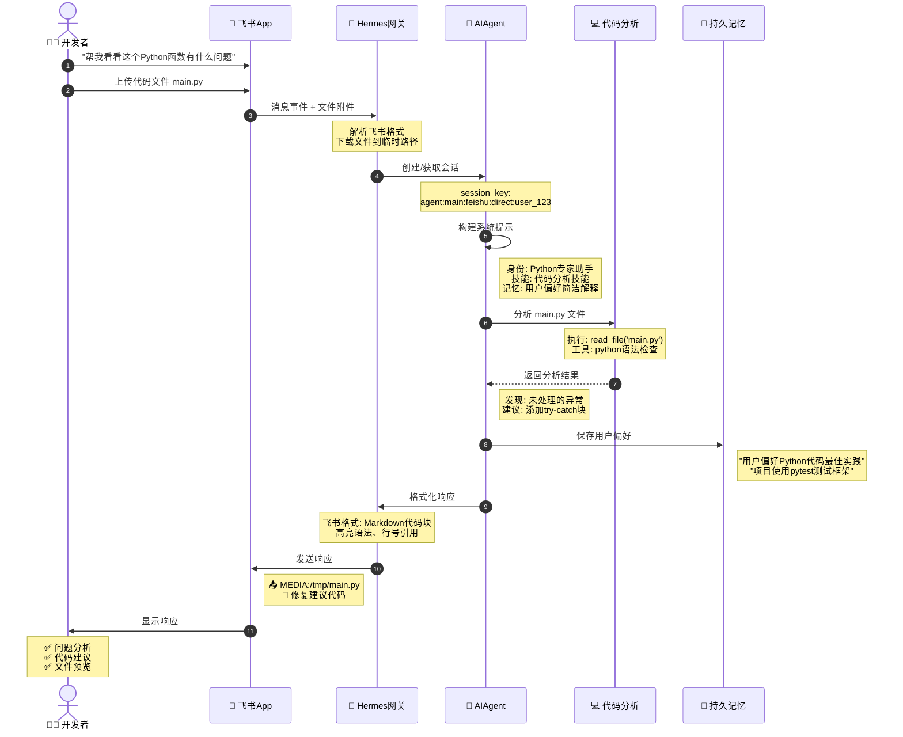
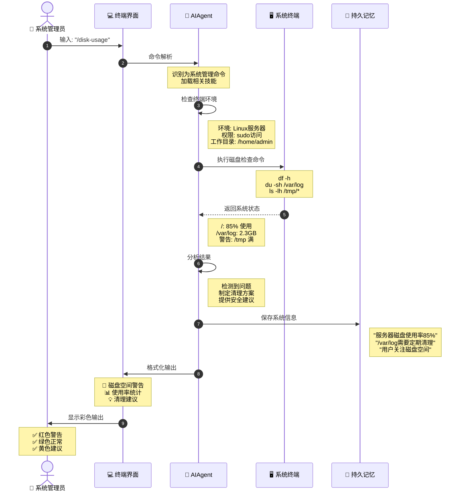
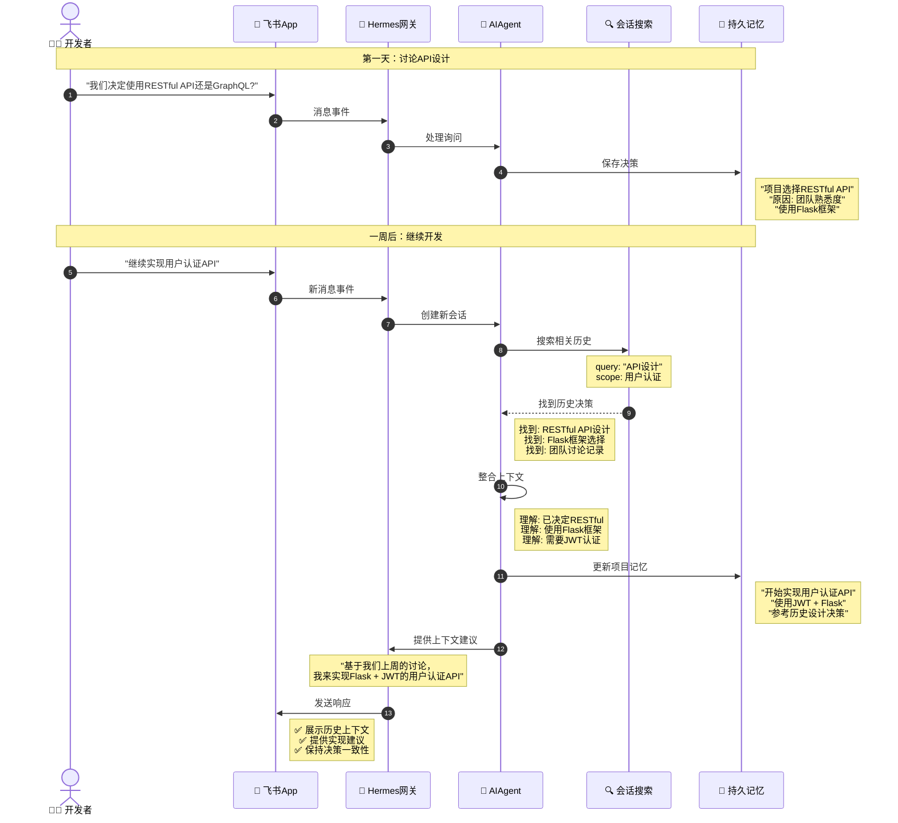
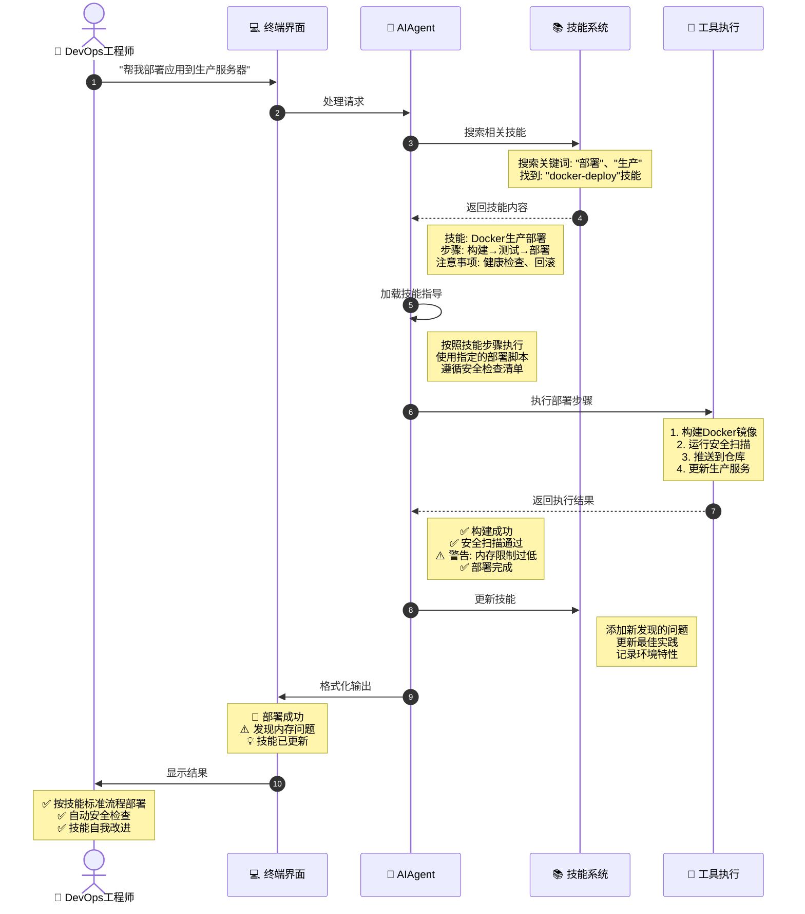
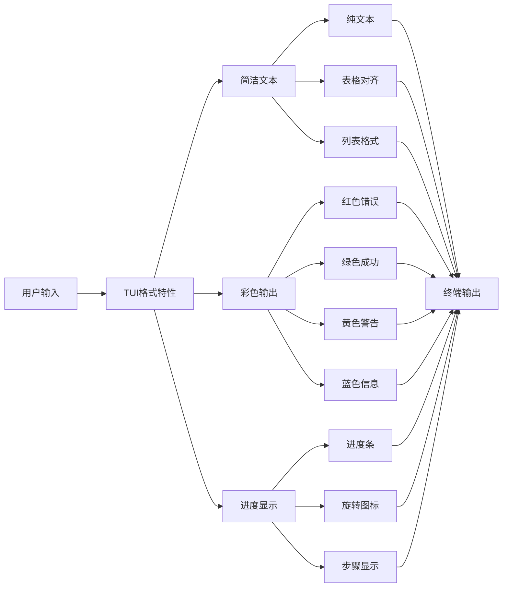
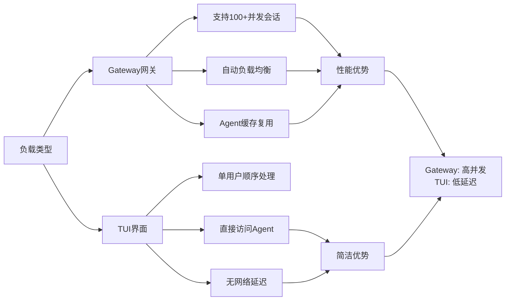
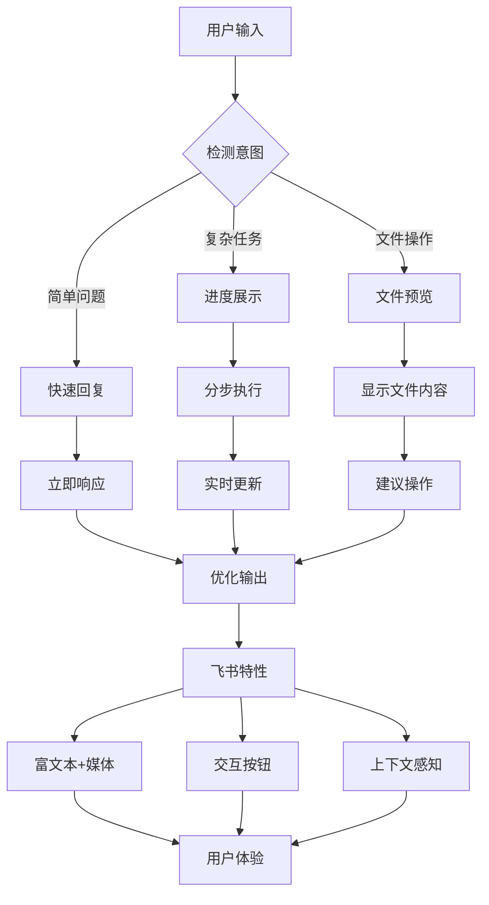
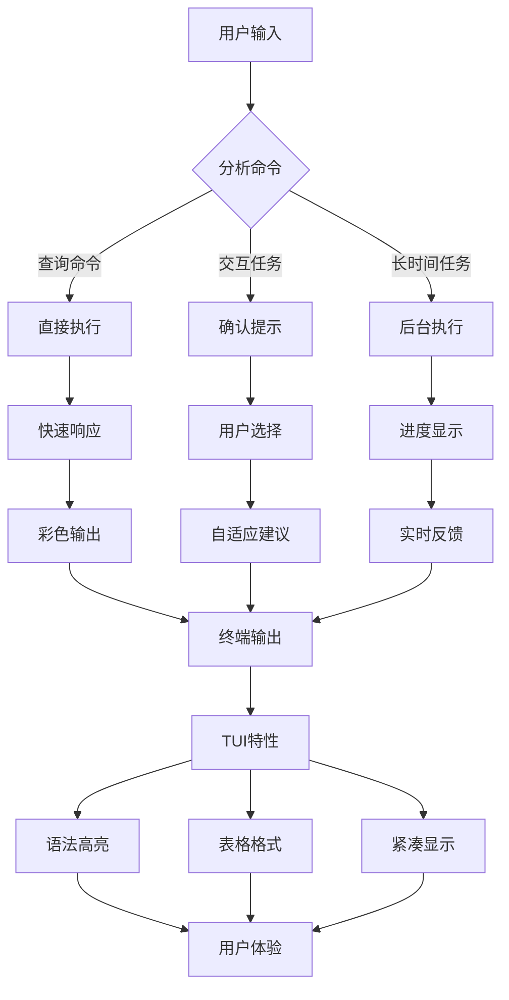
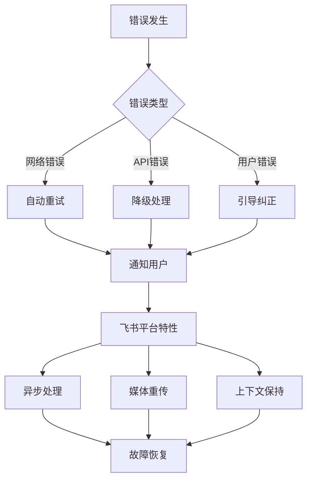
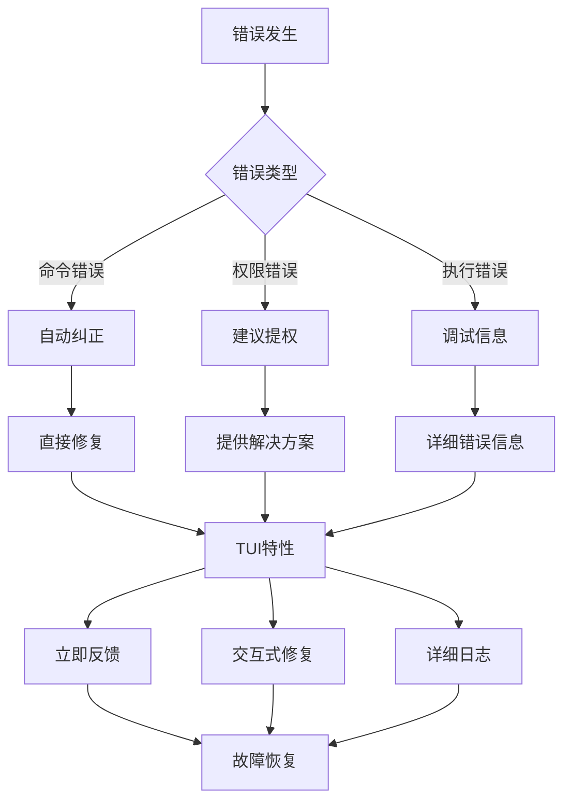

# Hermes Agent 用户交互流程图 - 实际示例

## 实际场景示例

### 场景1：飞书用户询问代码问题



### 场景2：TUI用户执行系统管理任务



### 场景3：飞书用户跨会话上下文召回



### 场景4：TUI用户使用技能系统



## 平台特性对比

### 飞书平台特性

```mermaid
flowchart LR
    Input[用户输入] --> Format[飞书格式特性]
    
    Format --> Rich[富文本支持]
    Format --> Media[媒体文件]
    Format --> At[@提及功能]
    Format --> Thread[消息线程]
    
    Rich --> Markdown[Markdown渲染]
    Rich --> Emoji[表情支持]
    Rich --> Code[代码高亮]
    
    Media --> Image[图片预览]
    Media --> Video[视频播放]
    Media --> File[文件下载]
    
    At --> User[用户提及]
    At --> Bot[机器人提及]
    At --> All[全体提及]
    
    Thread --> Reply[回复消息]
    Thread --> Quote[引用回复]
    Thread --> Forward[转发消息]
    
    Markdown --> Output[格式化输出]
    Emoji --> Output
    Code --> Output
    Image --> Output
    Video --> Output
    File --> Output
    User --> Output
    Bot --> Output
    All --> Output
    Reply --> Output
    Quote --> Output
    Forward --> Output
```

### TUI平台特性



## 性能对比分析

### 响应时间对比

```
飞书消息处理: ~2-5秒
- 平台适配: 100ms
- 网关路由: 50ms  
- 会话加载: 200ms
- Agent执行: 1-3秒
- 响应格式化: 100ms
- 平台投递: 200ms

TUI命令处理: ~1-3秒
- 命令解析: 50ms
- 直接调用: 0ms
- 会话加载: 150ms
- Agent执行: 0.5-2秒
- 终端输出: 50ms
- 界面渲染: 100ms
```

### 并发处理能力



## 用户体验优化

### 飞书体验优化



### TUI体验优化



## 故障处理对比

### 飞书故障处理



### TUI故障处理



## 总结

### 平台选择建议

**使用飞书平台**:
- 需要富文本和媒体支持
- 团队协作和讨论
- 异步沟通
- 文件共享和预览

**使用TUI界面**:
- 快速命令执行
- 系统管理任务
- 开发和调试
- 低延迟要求

### 最佳实践

1. **飞书**: 利用平台特性提升体验
2. **TUI**: 最大化终端效率和简洁性
3. **混合**: 根据任务特点选择合适入口
4. **一致**: 保持核心功能和记忆的同步

Hermes Agent 的多入口设计为不同场景提供了最优的交互方式，用户可以根据具体需求选择最合适的界面。
