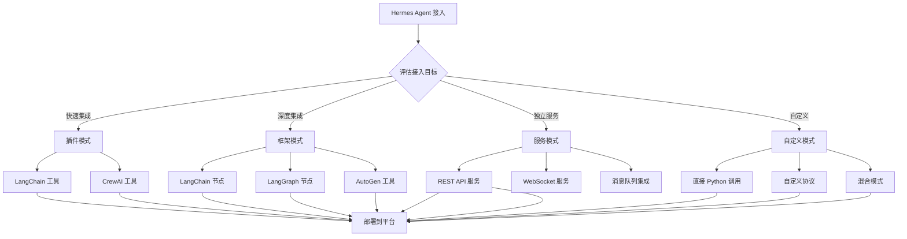
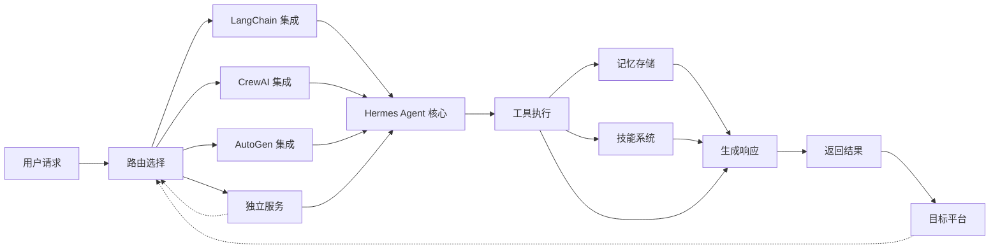
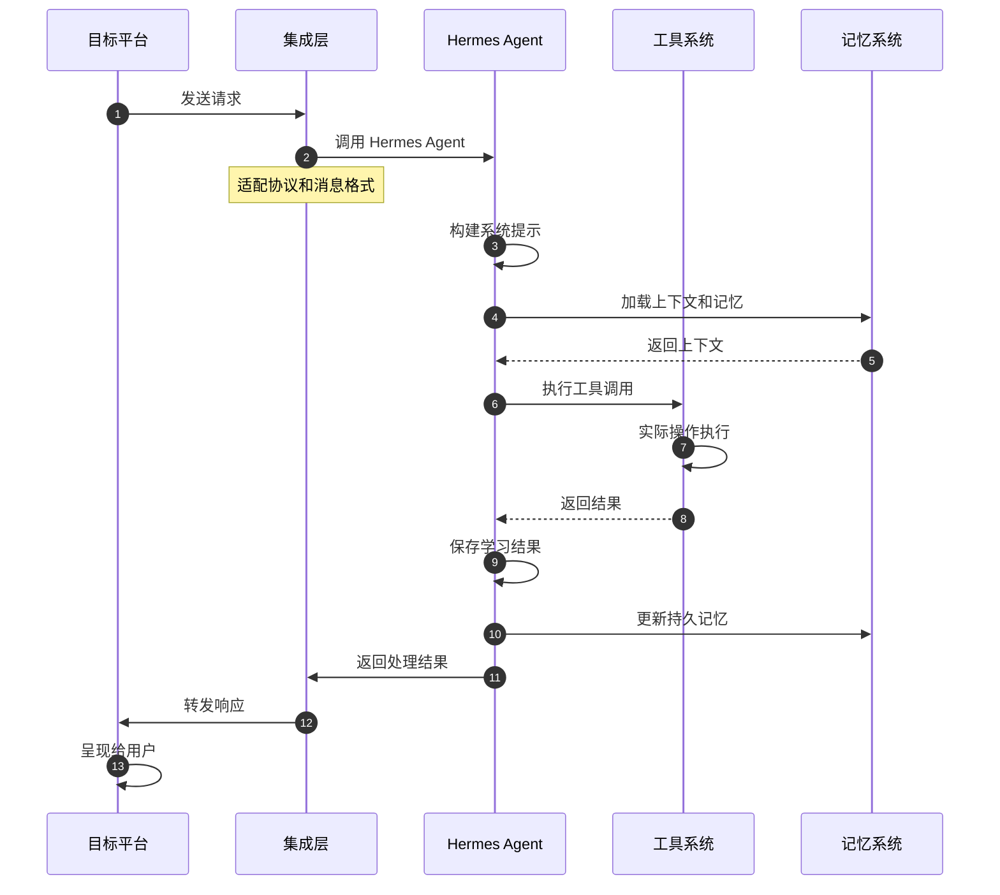

# Hermes Agent 接入主流 AI Agent 全链路平台方案

## 📊 主流 AI Agent 平台分析

### 当前市场领导者

| 平台 | 特点 | 架构模式 | 适合场景 |
|------|------|----------|----------|
| **LangChain** | 生态最成熟，工具丰富 | 链式调用 | 企业级应用 |
| **LangGraph** | 状态机式，复杂编排 | 图状态机 | 复杂多步任务 |
| **CrewAI** | 角色驱动，协作式 | Agent协作 | 团队协作任务 |
| **AutoGen** | 多代理对话，微软支持 | 对话式编程 | 研究和开发 |
| **AgentOps** | 可观测性，部署友好 | DevOps集成 | 生产环境 |
| **MetaGPT** | 任务规划，自主性强 | 目标导向 | 自主任务执行 |

## 🎯 Hermes Agent 的接入优势

### 核心竞争力

1. **自学习能力** - 从经验中创建和改进技能
2. **工具丰富** - 40+ 内置工具，支持自定义
3. **跨平台** - 统一的多平台消息接口
4. **持久记忆** - 跨会话的上下文保持
5. **多模型** - 支持 15+ LLM 提供商

### 适合集成的特性

- ✅ **即用型工具**: 无需复杂配置即可使用
- ✅ **自主管理**: 内存、技能、上下文自动管理
- ✅ **生产就绪**: 完善的错误处理和恢复机制
- ✅ **可扩展**: 易于添加新工具和技能

## 🔌 接入方案设计

### 方案对比



## 🚀 具体实施方案

### 方案1: LangChain 集成（推荐）

#### 1.1 作为 LangChain Tool

```python
from langchain.tools import tool
from run_agent import AIAgent

# 初始化 Hermes Agent
agent = AIAgent(
    base_url="http://localhost:30000/v1",
    model="claude-opus-4-20250514"
)

# 创建 LangChain 工具包装
@tool
def hermes_agent_tool(task: str) -> str:
    """
    使用 Hermes Agent 执行复杂任务
    
    Args:
        task: 任务描述
        
    Returns:
        执行结果
    """
    try:
        response = agent.run_conversation(task)
        return response.content
    except Exception as e:
        return f"Error: {str(e)}"

# 在 LangChain 中使用
from langchain.agents import AgentExecutor
from langchain.tools import Tool

# 创建 Agent 执行器
executor = AgentExecutor(
    agent=AgentType.OPENAI_FUNCTIONS,
    tools=[hermes_agent_tool],
    verbose=True
)

# 执行任务
result = executor.invoke({"input": "帮我部署应用到生产服务器"})
```

#### 1.2 作为 LangChain Agent

```python
from langchain.agents import AgentExecutor, Tool
from langchain.schema import BaseModel, Field

class HermesAgentInput(BaseModel):
    task: str = Field(..., description="要执行的任务")

class HermesAgentTool(Tool):
    name = "hermes_agent"
    description = "使用 Hermes Agent 执行复杂AI任务，包括代码编写、系统管理、文件操作等"
    func = hermes_agent_tool

# 集成到 LangChain 工作流
from langchain.chains import SequentialChain

# 创建任务链
task_chain = SequentialChain(
    agents=[
        AgentExecutor(
            name="planner",
            agent=AgentType.OPENAI_FUNCTIONS,
            tools=[hermes_agent_tool],
            verbose=True
        )
    ]
)

# 使用示例
result = task_chain.run({"input": "分析系统性能并优化"})
```

#### 1.3 作为 LangGraph 节点

```python
from langgraph.graph import StateGraph, END
from typing import TypedDict

class AgentState(TypedDict):
    input: str
    hermes_result: str
    validation: str
    final_output: str

def hermes_node(state: AgentState) -> AgentState:
    """Hermes Agent 处理节点"""
    result = agent.run_conversation(state["input"])
    state["hermes_result"] = result.content
    return state

def validation_node(state: AgentState) -> AgentState:
    """验证节点"""
    # 使用其他工具验证 Hermes 的结果
    state["validation"] = "验证通过"
    return state

# 构建图
workflow = StateGraph(AgentState)
workflow.add_node("hermes", hermes_node)
workflow.add_node("validation", validation_node)
workflow.add_edge("hermes", "validation")
workflow.add_edge("validation", END)

workflow.set_entry_point("hermes")
```

### 方案2: CrewAI 集成

#### 2.1 作为 CrewAI 工具

```python
from crewai.tools import tool
from run_agent import AIAgent

# 初始化 Hermes Agent
agent = AIAgent(
    base_url="http://localhost:30000/v1",
    model="claude-opus-4-20250514"
)

@tool(
    name="hermes_agent_execute",
    description="执行复杂的AI任务，包括代码编写、系统管理、文件操作等。"
)
def hermes_agent_tool(task: str) -> str:
    """
    Hermes Agent 工具 - 用于CrewAI agents调用
    
    Args:
        task: 要执行的任务描述
        
    Returns:
        任务执行结果
    """
    try:
        response = agent.run_conversation(task)
        return f"任务完成: {response.content}"
    except Exception as e:
        return f"任务失败: {str(e)}"

# 在 CrewAI 中使用
from crewai import Agent, Crew, Task

# 创建研究员 agent
researcher = Agent(
    role="研究员",
    goal="收集和分析信息",
    tools=[hermes_agent_tool, "web_search"],
    backstory="你是一个专业的研究员，擅长使用AI工具收集和分析信息"
)

# 创建开发者 agent
developer = Agent(
    role="开发者", 
    goal="编写和调试代码",
    tools=[hermes_agent_tool, "file_editor"],
    backstory="你是一个经验丰富的开发者，擅长使用AI工具开发和调试代码"
)

# 创建团队
crew = Crew(
    agents=[researcher, developer],
    process="sequential",
    verbose=True
)

# 执行任务
task = Task(
    description="调研最新的Python异步框架并实现示例代码",
    expected_output="完整的调研报告和可运行的代码示例"
)

result = crew.kickoff(tasks=[task])
```

#### 2.2 作为 CrewAI Agent

```python
from crewai import Agent, Process, Task
from run_agent import AIAgent

# 创建 Hermes Agent 实例
hermes_agent = AIAgent(
    base_url="http://localhost:30000/v1",
    model="claude-opus-4-20250514"
)

# 将 Hermes Agent 包装为 CrewAI Agent
hermes_agent_wrapper = Agent(
    role="Hermes AI Agent",
    goal="执行复杂的AI任务，包括代码编写、系统管理、文件操作等",
    backstory="""你是 Hermes Agent，一个自学习的 AI 助手。
    你拥有丰富的工具集和持久化记忆，能够从经验中学习和改进。
    你可以执行终端命令、操作文件、搜索网络、管理记忆等。""",
    tools=[],
    llm="claude-opus-4-20250514",
    verbose=True
)

# 在 CrewAI 流程中使用
research_task = Task(
    description="使用 Hermes Agent 分析系统性能瓶颈",
    agent=researcher,
    expected_output="详细的性能分析报告和优化建议"
)
```

### 方案3: AutoGen 集成

#### 3.1 作为 AutoGen 工具

```python
import autogen
from run_agent import AIAgent

# 初始化 Hermes Agent
agent = AIAgent(
    base_url="http://localhost:30000/v1",
    model="claude-opus-4-20250514"
)

# 创建 AutoGen 工具函数
def hermes_agent_tool(
    task: str,
    context: str = ""
) -> str:
    """
    Hermes Agent 工具 - 用于AutoGen agents调用
    
    Args:
        task: 要执行的任务
        context: 额外上下文信息
        
    Returns:
        任务执行结果
    """
    try:
        full_task = f"{task}\n\n上下文: {context}" if context else task
        response = agent.run_conversation(full_task)
        return response.content
    except Exception as e:
        return f"执行失败: {str(e)}"

# 定义 AutoGen agents
user_proxy = autogen.UserProxyAgent(
    name="user_proxy",
    human_input_mode="NEVER",
    max_consecutive_auto_reply=10,
    code_execution_config=False
)

assistant = autogen.AssistantAgent(
    name="assistant",
    llm_config={
        "config_list": [
            {
                "model": "claude-opus-4-20250514",
                "api_key": "your-anthropic-key"
            }
        ]
    },
    system_message="你是一个有用的AI助手，可以使用Hermes Agent来执行复杂任务。"
)

# 注册工具
autogen.register_function(
    hermes_agent_tool,
    name="hermes_agent",
    description="执行复杂的AI任务，包括代码编写、系统管理、文件操作等"
)

# 创建对话
assistant.reset()
user_proxy.initiate_chat(
    assistant,
    message="使用Hermes Agent分析当前系统性能并给出优化建议。"
)
user_proxy.run()
```

#### 3.2 作为 AutoGen Agent

```python
import autogen
from run_agent import AIAgent
from typing import Dict, Any

class HermesAgentAgent(autogen.ConversableAgent):
    """Hermes Agent 作为 AutoGen Agent"""
    
    def __init__(self, name: str, system_message: str, **kwargs):
        super().__init__(name, system_message, **kwargs)
        self.hermes_agent = AIAvent(
            base_url="http://localhost:30000/v1",
            model="claude-opus-4-20250514"
        )
    
    def generate_reply(
        self, 
        messages: autogen.Message,
        sender: autogen.Agent,
        config: autogen.GenerateConfig
    ) -> autogen.ChatMessage:
        """生成回复"""
        try:
            # 将 AutoGen 消息转换为 Hermes 格式
            task = self._convert_messages_to_task(messages)
            
            # 调用 Hermes Agent
            response = self.hermes_agent.run_conversation(task)
            
            # 转换回 AutoGen 格式
            return self._convert_response_to_autogen(response)
            
        except Exception as e:
            return autogen.ChatMessage(
                content=f"处理失败: {str(e)}",
                role="assistant"
            )
    
    def _convert_messages_to_task(self, messages) -> str:
        """转换消息为任务描述"""
        task_parts = []
        for msg in messages:
            if msg["role"] == "user":
                task_parts.append(msg["content"])
        return "\n".join(task_parts)
    
    def _convert_response_to_autogen(self, response) -> autogen.ChatMessage:
        """转换响应为 AutoGen 格式"""
        return autogen.ChatMessage(
            content=response.content,
            role="assistant"
        )

# 使用 Hermes Agent
agent = HermesAgentAgent(
    name="hermes_agent",
    system_message="你是Hermes Agent，一个自学习的AI助手。"
)
```

### 方案4: AgentOps 集成

#### 4.1 作为 AgentOps 技能插件

```python
from agentops import Agent, Tool
from run_agent import AIAgent

# 定义 Hermes Agent 技能
class HermesCapability(Tool):
    """Hermes Agent 工具包装"""
    name = "hermes_agent"
    description = "使用Hermes Agent执行复杂任务"
    
    def __init__(self):
        self.agent = AIAgent(
            base_url="http://localhost:30000/v1",
            model="claude-opus-4-20250514"
        )
    
    def run(self, task: str) -> str:
        """执行任务"""
        try:
            response = agent.run_conversation(task)
            return response.content
        except Exception as e:
            return f"Error: {str(e)}"

# 在 AgentOps 中使用
from agentops import Agent, ToolExecutor

# 创建 Agent
agent = Agent(
    name="research_agent",
    role="研究员",
    tools=[HermesCapability()],
    system_prompt="你是一个专业的研究员，使用Hermes Agent执行复杂任务。"
)

# 执行任务
result = agent.run("分析最新的AI框架发展趋势")
```

### 方案5: 独立服务集成

#### 5.1 REST API 服务

```python
from fastapi import FastAPI, HTTPException
from pydantic import BaseModel
from run_agent import AIAgent
import uvicorn

app = FastAPI(title="Hermes Agent API")

# 初始化 Hermes Agent
agent = AIAgent(
    base_url="http://localhost:30000/v1",
    model="claude-opus-4-20250514"
)

class TaskRequest(BaseModel):
    task: str
    session_id: str = None
    context: str = None

class TaskResponse(BaseModel):
    result: str
    session_id: str
    usage: dict = None

@app.post("/v1/execute", response_model=TaskResponse)
async def execute_task(request: TaskRequest):
    """执行Hermes Agent任务"""
    try:
        # 处理任务
        task_text = request.task
        if request.context:
            task_text = f"{task_text}\n\n上下文: {request.context}"
        
        # 执行任务
        response = agent.run_conversation(task_text)
        
        return TaskResponse(
            result=response.content,
            session_id=request.session_id or "default",
            usage=response.usage if hasattr(response, 'usage') else None
        )
    except Exception as e:
        raise HTTPException(status_code=500, detail=str(e))

@app.get("/v1/health")
async def health_check():
    """健康检查"""
    return {"status": "healthy", "agent": "hermes_agent"}

# 启动服务
if __name__ == "__main__":
    uvicorn.run(app, host="0.0.0.0", port=8080)
```

#### 5.2 消息队列集成

```python
from kombu import Queue, Exchange
import json
from run_agent import AIAgent

# 初始化
agent = AIAgent(
    base_url="http://localhost:30000/v1",
    model="claude-opus-4-20250514"
)

# 连接 RabbitMQ
queue = Queue('hermes_tasks', host='localhost')
queue.connect()

def process_task(ch, method, properties, body):
    """处理队列中的任务"""
    try:
        task_data = json.loads(body)
        response = agent.run_conversation(task_data['task'])
        
        # 发送结果到结果队列
        result_queue = Queue('hermes_results', host='localhost')
        result_queue.connect()
        
        result_queue.publish(
            json.dumps({
                'task_id': task_data['task_id'],
                'result': response.content,
                'status': 'completed'
            }),
            routing_key='results'
        )
    except Exception as e:
        print(f"Error processing task: {e}")
        
# 消费队列
queue.consume('tasks', process_task, no_ack=True)
```

## 🏗️ 架构设计

### 系统架构图



### 数据流设计



## 🔧 实施步骤

### 阶段1: 环境准备

```bash
# 1. 安装 Hermes Agent
git clone https://github.com/NousResearch/hermes-agent.git
cd hermes-agent
./setup-hermes.sh

# 2. 安装目标平台 SDK
# LangChain
pip install langchain langchain-openai langchain-community

# CrewAI
pip install crewai crewai-tools

# AutoGen
pip install pyautogen

# 3. 配置环境变量
export ANTHROPIC_API_KEY="your-key"
export OPENAI_API_KEY="your-key"
```

### 阶段2: 集成开发

**LangChain 集成示例**:

```python
# 保存为 langchain_integration.py
from langchain.agents import initialize_agent, Tool
from langchain.tools import StructuredTool
from run_agent import AIAgent

# 初始化
agent = AIAgent(
    base_url="http://localhost:30000/v1",
    model="claude-opus-4-20250514"
)

# 创建工具
hermes_tool = StructuredTool.from_function(
    func=agent.run_conversation,
    name="hermes_agent",
    description="使用Hermes Agent执行复杂AI任务"
)

# 测试集成
result = hermes_tool.func("帮我分析系统性能")
print(result)
```

### 阶段3: 部署和测试

```bash
# 1. 测试基础功能
python test_integration.py

# 2. 启动服务（如果是独立服务模式）
python hermes_service.py

# 3. 集成测试
python test_integration_with_platform.py
```

## 📊 性能对比和优化

### 集成方案对比

| 方案 | 复杂度 | 灵活性 | 性能 | 推荐度 |
|------|--------|--------|------|--------|
| **LangChain Tool** | ⭐⭐ | ⭐⭐ | ⭐⭐⭐⭐ | ⭐⭐⭐⭐⭐ |
| **CrewAI Tool** | ⭐⭐ | ⭐⭐⭐ | ⭐⭐⭐ | ⭐⭐⭐⭐ |
| **LangGraph 节点** | ⭐⭐⭐ | ⭐⭐⭐⭐ | ⭐⭐⭐⭐ | ⭐⭐⭐⭐⭐ |
| **独立服务** | ⭐⭐⭐⭐ | ⭐⭐⭐⭐⭐ | ⭐⭐⭐ | ⭐⭐⭐ |

### 优化策略

1. **连接池化**: 复用 Agent 实例
2. **异步处理**: 使用异步 I/O 提升并发
3. **缓存机制**: 缓存常用请求和响应
4. **负载均衡**: 多实例部署分担负载

## 🎯 推荐方案

### 场景1: 快速原型开发 → **LangChain Tool**

```python
# 最简单的集成方式
from langchain.tools import StructuredTool
from run_agent import AIAgent

agent = AIAgent(model="claude-opus-4-20250514")
hermes_tool = StructuredTool.from_function(
    func=agent.run_conversation,
    name="hermes_agent",
    description="执行复杂AI任务"
)
```

### 场景2: 多Agent协作 → **CrewAI**

```python
# 利用 Hermes Agent 的工具丰富性
from crewai import Agent, Crew

specialist = Agent(
    role="系统管理专家",
    tools=[hermes_agent_tool, "terminal", "file_ops"],
    backstory="使用Hermes Agent进行系统管理任务"
)
```

### 场景3: 复杂工作流 → **LangGraph**

```python
# 利用 Hermes Agent 的学习能力
workflow.add_node("learning", hermes_learning_node)
workflow.add_conditional_edges("learning", decide_next_step)
```

### 场景4: 生产部署 → **独立服务**

```python
# 作为微服务部署
# 提供标准化 API 接口
# 支持多种集成方式
```

## 🚀 快速开始模板

### 模板1: LangChain 快速集成

```python
# langchain_hermes_quick_start.py
from langchain.tools import StructuredTool
from run_agent import AIAgent

# 初始化 Hermes Agent
agent = AIAgent(model="claude-opus-4-20250514")

# 创建工具
hermes_tool = StructuredTool.from_function(
    func=lambda task: agent.run_conversation(task).content,
    name="hermes_agent",
    description="执行复杂AI任务，包括代码编写、系统管理、文件操作等"
)

# 立即使用
from langchain.agents import AgentExecutor

executor = AgentExecutor.from_agent_and_tools(
    agent=AgentType.OPENAI_FUNCTIONS,
    tools=[hermes_tool],
    verbose=True
)

result = executor.invoke({"input": "帮我优化Docker配置"})
print(result['output'])
```

### 模板2: CrewAI 团队集成

```python
# crewai_hermes_team.py
from crewai import Agent, Crew, Task
from run_agent import AIAgent

# 初始化
agent = AIAgent(model="claude-opus-4-20250514")
hermes_tool = StructuredTool.from_function(
    func=agent.run_conversation,
    name="hermes_agent",
    description="Hermes AI Agent - 自学习的AI助手"
)

# 创建团队成员
analyst = Agent(
    role="分析师",
    goal="分析问题和制定解决方案",
    tools=[hermes_tool, "web_search"],
    backstory="你是一个专业分析师，使用Hermes Agent执行复杂分析任务"
)

developer = Agent(
    role="开发者",
    goal="编写和实现代码解决方案",
    tools=[hermes_tool, "file_editor", "terminal"],
    backstory="你是一个经验丰富的开发者，使用Hermes Agent辅助开发工作"
)

# 创建团队
crew = Crew(
    agents=[analyst, developer],
    process="sequential",
    verbose=True
)

# 执行任务
crew.kickoff(tasks=[
    Task(
        description="分析当前系统架构并提供优化建议",
        expected_output="详细的架构分析报告和优化方案"
    )
])
```

### 模板3: REST API 服务

```python
# hermes_api_service.py
from fastapi import FastAPI
from pydantic import BaseModel
from run_agent import AIAgent

app = FastAPI(title="Hermes Agent Service")

agent = AIAgent(model="claude-opus-4-20250514")

class TaskRequest(BaseModel):
    task: str
    session_id: str = None

@app.post("/api/v1/execute")
async def execute_task(request: TaskRequest):
    """API接口"""
    response = agent.run_conversation(request.task)
    return {
        "result": response.content,
        "session_id": request.session_id,
        "usage": response.usage
    }

# 启动服务
# uvicorn hermes_api_service.py:app --reload --host 0.0.0.0 --port 8080
```

## 📝 配置和部署

### 环境配置

```bash
# config.py
import os
from typing import Dict

class Config:
    # Hermes Agent 配置
    HERMES_BASE_URL = os.getenv("HERMES_BASE_URL", "http://localhost:30000/v1")
    HERMES_MODEL = os.getenv("HERMES_MODEL", "claude-opus-4-20250514")
    
    # LLM 提供商配置
    ANTHROPIC_API_KEY = os.getenv("ANTHROPIC_API_KEY")
    OPENAI_API_KEY = os.getenv("OPENAI_API_KEY")
    
    # 服务配置
    SERVICE_PORT = int(os.getenv("SERVICE_PORT", "8080"))
    LOG_LEVEL = os.getenv("LOG_LEVEL", "INFO")
```

### Docker 部署

```dockerfile
# Dockerfile
FROM python:3.11-slim

WORKDIR /app

# 安装依赖
COPY requirements.txt .
RUN pip install --no-cache-dir -r requirements.txt

# 复制代码
COPY . .

# 暴露端口
EXPOSE 8080

# 启动服务
CMD ["python", "-m", "uvicorn", "hermes_api_service:app", "--host", "0.0.0.0", "--port", "8080"]
```

### Docker Compose

```yaml
# docker-compose.yml
version: '3.8'

services:
  hermes-integration:
    build: .
    ports:
      - "8080:8080"
    environment:
      - HERMES_BASE_URL=http://hermes-agent:30000/v1
      - ANTHROPIC_API_KEY=${ANTHROPIC_API_KEY}
    volumes:
      - ./logs:/app/logs
    depends_on:
      - hermes-agent
  
  hermes-agent:
    image: hermes-agent:latest
    ports:
      - "3000:3000"
    volumes:
      - ~/.hermes:/opt/data
```

## 🎓 最佳实践

### 1. 错误处理

```python
def safe_hermes_call(task: str, max_retries=3) -> str:
    """安全的Hermes调用"""
    for attempt in range(max_retries):
        try:
            response = agent.run_conversation(task)
            return response.content
        except Exception as e:
            if attempt < max_retries - 1:
                time.sleep(2 ** attempt)  # 指数退避
                continue
            else:
                return f"执行失败: {str(e)}"
```

### 2. 监控和日志

```python
import logging
from opentelemetry import trace

logging.basicConfig(level=logging.INFO)
logger = logging.getLogger(__name__)

@tracer.start_as_current_span(name="hermes_execution")
def execute_with_tracing(task: str) -> str:
    """带追踪的执行"""
    with tracer.start_as_current_span(name="task_execution"):
        logger.info(f"执行任务: {task}")
        result = agent.run_conversation(task)
        logger.info(f"任务完成")
        return result.content
```

### 3. 测试策略

```python
import pytest
from run_agent import AIAgent

@pytest.fixture
def hermes_agent():
    return AIAgent(model="claude-opus-4-20250514")

def test_simple_query(hermes_agent):
    """测试简单查询"""
    response = hermes_agent.run_conversation("2+2等于几?")
    assert "4" in response.content

def test_code_generation(hermes_agent):
    """测试代码生成"""
    response = hermes_agent.run_conversation("写一个Python函数计算斐波那契数列")
    assert "def" in response.content and "fibonacci" in response.content

def test_tool_usage(hermes_agent):
    """测试工具使用"""
    response = hermes_agent.run_conversation<arg_value>("列出当前目录的文件")
    assert "File" in response.content or "文件" in response.content
```

## 🔗 示例项目和资源

### 开源项目
1. **Hermes Agent**: https://github.com/NousResearch/hermes-agent
2. **LangChain**: https://github.com/langchain-ai/langchain
3. **CrewAI**: https://github.com/joaomdmoura/crewAI
4. **AutoGen**: https://github.com/microsoft/autogen

### 文档资源
1. **Hermes Agent 文档**: https://hermes-agent.nousresearch.com/docs/
2. **LangChain 文档**: https://python.langchain.com/
3. **CrewAI 文档**: https://docs.crewai.com/
4. **AutoGen 文档**: https://microsoft.github.io/autogen/

## 💡 高级技巧

### 1. 双向集成

```python
# 让 Hermes Agent 使用其他平台的工具
from langchain.tools import Tool
from hermes_cli.tools_config import get_available_tools

def create_hermes_with_langchain_tools():
    """为Hermes Agent添加LangChain工具"""
    # 获取Hermes可用工具
    hermes_tools = get_available_tools()
    
    # 添加LangChain工具
    langchain_tools = [
        Tool(name="search", func=lambda q: web_search(q)),
        Tool(name="database", func=execute_sql_query)
    ]
    
    return hermes_tools + langchain_tools
```

### 2. 记忆和技能共享

```python
# 让其他平台访问Hermes的记忆和技能
def share_hermes_memory(platform_agent, hermes_memory_path):
    """共享Hermes记忆到其他平台"""
    import json
    
    # 读取Hermes记忆
    with open(hermes_memory_path, 'r') as f:
        hermes_memory = json.load(f)
    
    # 转换为目标平台格式
    platform_agent.load_memory(hermes_memory)
```

### 3. 联邦学习

```python
# 联邦学习：让不同平台互相学习
def federated_learning(hermes_agent, langchain_agent):
    """联邦学习"""
    # 收集Hermes的学习数据
    hermes_learning_data = hermes_agent.export_learning_data()
    
    # 训练LangChain模型
    langchain_agent.fine_tune(hermes_learning_data)
    
    # 将训练结果反馈到Hermes
    hermes_agent.import_model_updates(langchain_agent.get_model())
```

## 🎯 总结和建议

### 推荐集成路径

1. **快速验证**: 使用 LangChain Tool 模式（5分钟）
2. **团队协作**: 使用 CrewAI 模式（1小时）
3. **复杂编排**: 使用 LangGraph 模式（1天）
4. **生产部署**: 使用独立服务模式（3-5天）

### 关键成功因素

1. **明确目标**: 选择合适的集成模式
2. **渐进实施**: 从简单到复杂逐步集成
3. **充分测试**: 确保集成的可靠性
4. **监控优化**: 持续监控性能和用户体验
5. **文档维护**: 保持文档和代码的同步更新

Hermes Agent 的独特价值在于其自学习能力和丰富的工具集，通过正确集成到主流平台，可以充分发挥这些优势，为用户提供更强大的AI Agent能力。
