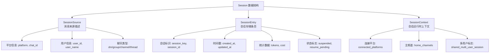
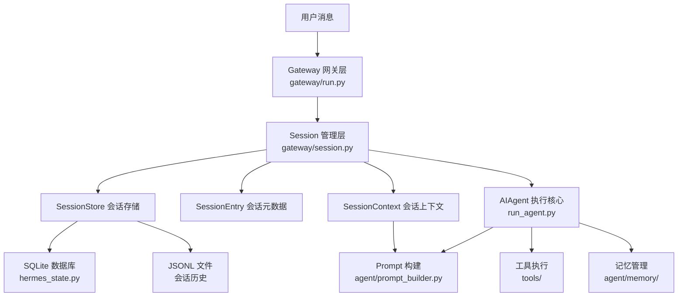
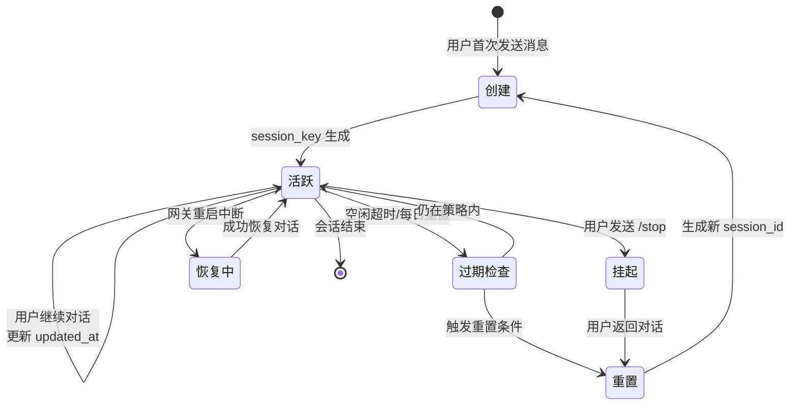
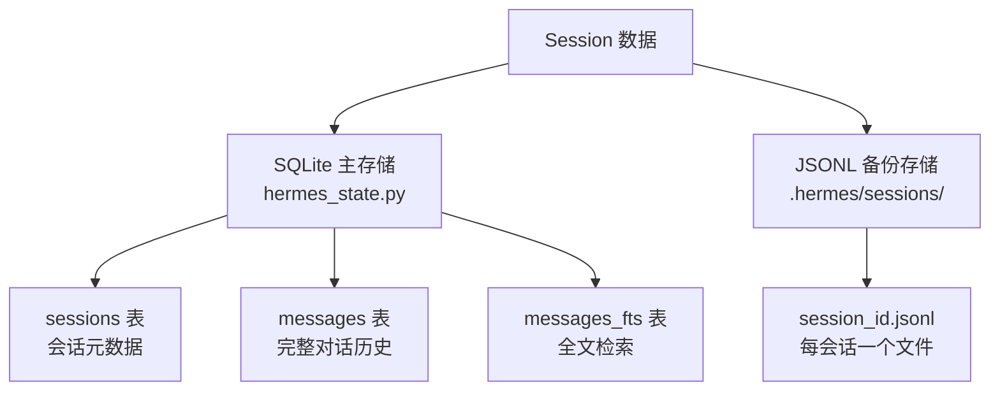

# Hermes Agent Session 概念与架构详解

## 1. 这篇文档关注什么

本文档专注于解释 Hermes Agent 中 **Session（会话）** 的核心概念、架构位置和实现机制。

解决的核心问题：
- Session 在 Hermes Agent 中到底是什么
- Session 在整体架构中扮演什么角色
- Session 如何识别和管理不同的对话上下文
- Session 如何支持多平台、多用户的并发对话
- Session 的生命周期和状态管理

## 2. Session 的核心定义

### 2.1 一句话定义

**Session 是 Hermes Agent 中表示持续对话上下文的抽象，是用户与 Agent 之间一次完整交互会话的逻辑边界。**

### 2.2 Session 的本质特征

1. **上下文边界**: Session 定义了一段连续对话的起止范围
2. **状态载体**: Session 携带对话历史、用户信息、环境状态
3. **隔离单元**: Session 实现不同用户/对话的相互隔离
4. **持久化实体**: Session 可以跨网关重启保持和恢复

### 2.3 Session 的价值定位

Session 是 Hermes Agent 从"单次问答工具"升级为"长期对话平台"的关键基础设施：
- **无 Session**: 只能处理单次请求，无法保持上下文
- **有 Session**: 支持连续对话、上下文记忆、状态恢复

## 3. Session 的组成结构

### 3.1 三层数据结构



### 3.2 SessionSource - 消息来源描述

**文件位置**: `gateway/session.py`

**作用**: 描述消息的来源信息，用于会话识别和响应路由

```python
@dataclass
class SessionSource:
    # 平台和聊天基础信息
    platform: Platform        # 平台类型（飞书、Telegram、CLI等）
    chat_id: str              # 聊天ID
    chat_type: str            # 聊天类型：dm/group/channel/thread
    chat_name: str            # 聊天名称
    
    # 用户信息
    user_id: str              # 用户ID
    user_name: str            # 用户名
    user_id_alt: str          # 备用用户ID（Signal UUID等）
    
    # 高级标识
    thread_id: str            # 线程ID（Discord threads、Telegram topics）
    guild_id: str             # 服务器/工作区ID（Discord、Slack）
    parent_chat_id: str       # 父频道ID（threads使用）
    
    # 元数据
    is_bot: bool              # 是否为机器人消息
    message_id: str           # 触发消息ID
```

**关键特性**:
- 支持 17+ 种消息平台
- 区分 DM、群组、频道、线程等聊天类型
- 支持平台特定标识（如 Discord guild_id）

### 3.3 SessionEntry - 会话存储条目

**文件位置**: `gateway/session.py`

**作用**: 会话的持久化存储记录

```python
@dataclass
class SessionEntry:
    # 会话标识
    session_key: str          # 会话唯一键
    session_id: str           # 会话实例ID（时间戳+UUID）
    
    # 时间信息
    created_at: datetime      # 创建时间
    updated_at: datetime      # 最后活动时间
    
    # 来源信息
    origin: SessionSource     # 消息来源
    
    # Token 统计
    input_tokens: int         # 输入token数
    output_tokens: int        # 输出token数
    total_tokens: int         # 总token数
    estimated_cost_usd: float # 预估成本
    
    # 状态标志
    was_auto_reset: bool      # 是否自动重置
    suspended: bool           # 是否暂停
    resume_pending: bool      # 是否等待恢复
    is_fresh_reset: bool      # 是否为新重置
```

**关键特性**:
- 记录完整的会话元数据
- 支持 Token 使用统计和成本估算
- 提供多种状态标志用于会话管理

### 3.4 SessionContext - 会话运行时上下文

**文件位置**: `gateway/session.py`

**作用**: 会话的完整上下文，注入到 Agent 系统提示中

```python
@dataclass
class SessionContext:
    source: SessionSource                    # 消息来源
    connected_platforms: List[Platform]      # 已连接平台
    home_channels: Dict[Platform, HomeChannel] # 主频道配置
    shared_multi_user_session: bool          # 多用户共享标志
```

**关键特性**:
- 动态构建，每次调用 Agent 时生成
- 注入到系统提示，让 Agent 知道当前环境
- 支持平台特定提示（如 Discord ID、Slack API 限制）

## 4. Session 在整体架构中的位置

### 4.1 架构层次图



### 4.2 Session 的连接作用

**向上连接 Gateway**:
```python
# gateway/run.py
def _handle_message(self, event: MessageEvent):
    # 1. 解析会话密钥
    session_key = self._parse_session_key(event)
    
    # 2. 获取或创建会话
    session_entry = self.session_store.get_or_create_session(source)
    
    # 3. 构建会话上下文
    session_context = build_session_context(source, self.config, session_entry)
```

**向下连接 AIAgent**:
```python
# gateway/run.py  
def _route_to_agent(self, session, event, session_context):
    # 1. 加载历史对话
    history = self.session_store.load_transcript(session.session_id)
    
    # 2. 构建系统提示（包含 session context）
    system_prompt = build_system_prompt(session_context)
    
    # 3. 调用 Agent
    response = self.agent.run_conversation(event.content, history)
```

## 5. Session 识别和隔离机制

### 5.1 Session Key 的构建规则

**文件位置**: `gateway/session.py::build_session_key()`

**格式**: `agent:main:{platform}:{chat_type}:{chat_id}:{user_id}:{thread_id}`

**示例**:
```
# 飞书 DM 对话
agent:main:feishu:dm:ou_xxx:alice

# Telegram 群组中 Bob 的对话
agent:main:telegram:group:-100xxx:bob

# Discord 线程对话
agent:main:discord:channel:123456:789:thread_xyz
```

**构建规则**:
1. **DM 会话**: 按 `chat_id` 隔离，每个用户独立
2. **群组会话**: 默认按 `user_id` 隔离，支持多用户模式
3. **线程会话**: 默认共享（所有参与者看到相同对话）

### 5.2 会话隔离策略

```python
def is_shared_multi_user_session(
    source: SessionSource,
    group_sessions_per_user: bool = True,
    thread_sessions_per_user: bool = False
) -> bool:
    """判断是否为多用户共享会话"""
    
    # DM 永远不是共享的
    if source.chat_type == "dm":
        return False
    
    # 线程默认共享（除非启用 thread_sessions_per_user）
    if source.thread_id:
        return not thread_sessions_per_user
    
    # 群组默认隔离用户（除非禁用 group_sessions_per_user）
    return not group_sessions_per_user
```

**实际应用**:

| 聊天类型 | 默认行为 | 配置选项 | 应用场景 |
|---------|---------|----------|----------|
| DM | 用户隔离 | 无 | 私密对话，每个用户独立 |
| 群组 | 用户隔离 | `group_sessions_per_user=False` | 多用户共享或用户独立 |
| 线程 | 多用户共享 | `thread_sessions_per_user=True` | 协作讨论或独立对话 |

### 5.3 平台特定标识处理

**WhatsApp**:
```python
# 处理 JID/LID 转换问题
dm_chat_id = canonical_whatsapp_identifier(source.chat_id)
```

**Discord**:
```python
# 提供 Discord 特定 ID 用于工具调用
guild_id: str           # Server ID
parent_chat_id: str     # Parent channel ID for threads
thread_id: str          # Thread ID (作为 channel_id 使用)
```

## 6. Session 的生命周期管理

### 6.1 生命周期流程



### 6.2 重置策略

**文件位置**: `gateway/config.py::SessionResetPolicy`

**支持的模式**:

```python
@dataclass
class SessionResetPolicy:
    mode: str              # "none", "idle", "daily", "both"
    idle_minutes: int      # 空闲超时分钟数（默认30）
    at_hour: int           # 每日重置时间（默认凌晨3点）
```

**实际应用**:

| 策略模式 | 触发条件 | 典型应用场景 |
|---------|---------|-------------|
| `none` | 永不重置 | 长期项目对话、重要工作会话 |
| `idle` | 30分钟无活动 | 临时咨询、快速问答 |
| `daily` | 每天凌晨3点 | 每日任务助手、工作日志 |
| `both` | 空闲或每日 | 综合策略，平衡记忆和隐私 |

### 6.3 状态恢复机制

**suspended（暂停状态）**:
- **触发**: 用户发送 `/stop` 命令
- **效果**: 下次访问强制创建新会话
- **用途**: 解决 stuck-resume 循环问题

**resume_pending（恢复待定）**:
- **触发**: 网关重启中断正在执行的会话
- **效果**: 保持 `session_id`，自动恢复对话
- **用途**: 防止重启导致的对话丢失

**is_fresh_reset（新重置标志）**:
- **触发**: 用户发送 `/new` 或 `/reset`
- **效果**: 触发技能系统重新注入
- **用途**: 明确的用户重置意图

## 7. Session 的持久化存储

### 7.1 双存储架构



**SQLite 存储** (`hermes_state.py`):
```python
class SessionDB:
    def create_session(self, session_id, source, user_id)
    def end_session(self, session_id, reason)
    def append_message(self, session_id, role, content, ...)
    def get_messages_as_conversation(self, session_id)
```

**JSONL 存储** (`gateway/session.py`):
```python
# 向后兼容，用于工具和调试
transcript_path = sessions_dir / f"{session_id}.jsonl"
```

### 7.2 会话历史格式

**消息结构**:
```json
{
  "role": "user|assistant|tool|system",
  "content": "消息内容",
  "tool_calls": [...],           // 工具调用
  "tool_call_id": "...",         // 工具调用ID
  "tool_name": "...",            // 工具名称
  "reasoning": "...",            // 模型推理过程
  "codex_reasoning_items": [...] // 代码推理项
}
```

**加载对话历史**:
```python
def load_transcript(self, session_id: str) -> List[Dict]:
    # 优先使用 SQLite，fallback 到 JSONL
    db_messages = self._db.get_messages_as_conversation(session_id)
    jsonl_messages = load_jsonl_transcript(session_id)
    
    # 使用更长的历史（防止截断）
    return jsonl_messages if len(jsonl_messages) > len(db_messages) else db_messages
```

## 8. Session 上下文注入

### 8.1 动态系统提示构建

**文件位置**: `gateway/session.py::build_session_context_prompt()`

**注入内容示例**:

```markdown
## Current Session Context

**Source:** Feishu (group: 开发团队)
**Channel Topic:** Hermes Agent 项目讨论
**Session type:** Multi-user session — messages are prefixed with [sender name]

**Connected Platforms:** local (files on this machine), feishu: Connected ✓

**Home Channels (default destinations):**
  - feishu: Hermes 测试群 (ID: group_xxx)

**Delivery options for scheduled tasks:**
- `"origin"` → Back to this chat (Hermes 测试群)
- `"local"` → Save to local files only (/home/user/.hermes/cron/output/)
- `"feishu"` → Home channel (Hermes 测试群)

*For explicit targeting, use `"platform:chat_id"` format if the user provides a specific chat ID.*
```

### 8.2 平台特定提示

**Discord**:
```python
if _discord_tools_loaded():
    # 提供 Discord ID 用于工具调用
    lines.extend([
        f"  - Guild: `{guild_id}`",
        f"  - Channel: `{chat_id}`",
        f"  - Triggering message: `{message_id}`"
    ])
else:
    # 警告没有 Discord API 访问权限
    lines.extend([
        "**Platform notes:** You are running inside Discord. ",
        "You do NOT have access to Discord-specific APIs..."
    ])
```

**iMessage**:
```python
elif context.source.platform == Platform.BLUEBUBBLES:
    lines.extend([
        "**Platform notes:** You are responding via iMessage. ",
        "Keep responses short and conversational — think texts, not essays.",
        "Structure longer replies as separate short thoughts..."
    ])
```

## 9. Session 在实际使用中的体现

### 9.1 飞书用户对话

**场景**: Alice 在飞书中与 Hermes 对话

**Session 信息**:
```
session_key: "agent:main:feishu:dm:ou_xxx:alice"
session_id: "20250117_143022_a1b2c3d4"
platform: feishu
chat_type: dm
user: alice (ou_xxx)
```

**体验效果**:
- 记忆 Alice 的所有对话历史
- 跨消息自动恢复上下文
- 30分钟不活动后自动重置
- 支持文件传输、富文本回复

### 9.2 Telegram 群组对话

**场景**: Bob 在 "Python 学习" 群组中使用 Hermes

**Session 信息**:
```
session_key: "agent:main:telegram:group:-100xxx:bob"
session_id: "20250117_150000_c9d8e7f6"
platform: telegram
chat_type: group
user: bob (user_xxx)
```

**体验效果**:
- Bob 有独立的对话上下文
- 其他群成员不会看到 Bob 的对话
- 支持 `/reset` 手动重置
- 可以引用群组消息回复

### 9.3 Discord 线程对话

**场景**: 开发团队在 Discord 论坛线程中讨论

**Session 信息**:
```
session_key: "agent:main:discord:channel:123456:thread_xyz"
session_id: "20250117_160000_e1f2g3h4"
platform: discord
chat_type: thread
shared_multi_user_session: true
```

**体验效果**:
- 所有线程参与者共享对话历史
- 可以访问 Discord API（如果启用工具）
- 支持 `@mention` 和回复功能
- 线程归档后对话可搜索

## 10. Session 的关键设计特性

### 10.1 多进程并发安全

**WAL 模式**:
```python
# hermes_state.py
conn = sqlite3.connect(db_path, isolation_level=None)
conn.execute("PRAGMA journal_mode=WAL")
conn.execute("PRAGMA busy_timeout=5000")
```

**竞争处理**:
```python
# 重试 + 抖动
for attempt in range(max_retries):
    try:
        return operation()
    except sqlite3.OperationalError:
        if attempt < max_retries - 1:
            time.sleep(random.uniform(0.1, 0.5))
        else:
            raise
```

### 10.2 跨平台统一抽象

**平台适配器**:
```python
# 所有平台转换为统一的 SessionSource
class PlatformAdapter:
    def _create_message_event(self, raw_event) -> MessageEvent:
        return MessageEvent(
            platform=self.platform,
            chat_id=self._extract_chat_id(raw_event),
            user_id=self._extract_user_id(raw_event),
            ...
        )
```

**统一会话管理**:
```python
# Gateway 处理所有平台的消息
def _handle_message(self, event: MessageEvent):
    source = SessionSource(
        platform=event.platform,
        chat_id=event.chat_id,
        user_id=event.user_id,
        ...
    )
    session_entry = self.session_store.get_or_create_session(source)
```

### 10.3 渐进式持久化

**内存缓存**:
```python
# SessionEntry 内存缓存
self._entries: Dict[str, SessionEntry] = {}

# 快速访问当前会话
def get_or_create_session(self, source: SessionSource):
    if session_key in self._entries:
        return self._entries[session_key]
```

**磁盘持久化**:
```python
# 定期保存到 sessions.json
def _save(self):
    data = {key: entry.to_dict() for key, entry in self._entries.items()}
    json.dump(data, sessions_file, indent=2)
```

**数据库归档**:
```python
# SQLite 完整历史
self._db.create_session(session_id, source, user_id)
self._db.append_message(session_id, role, content, ...)
```

## 11. Session 的监控和调试

### 11.1 会话统计信息

**Token 使用**:
```python
entry.input_tokens: int      # 输入 token 数
entry.output_tokens: int     # 输出 token 数
entry.total_tokens: int      # 总 token 数
entry.last_prompt_tokens: int # 最后一次提示词 token 数
```

**成本估算**:
```python
entry.estimated_cost_usd: float  # 预估成本（美元）
entry.cost_status: str           # 成本状态
```

### 11.2 会话状态查询

**列出活跃会话**:
```python
def list_sessions(self, active_minutes: Optional[int] = None):
    """列出所有会话，可按活跃时间过滤"""
    entries = list(self._entries.values())
    
    if active_minutes:
        cutoff = _now() - timedelta(minutes=active_minutes)
        entries = [e for e in entries if e.updated_at >= cutoff]
    
    return sorted(entries, key=lambda e: e.updated_at, reverse=True)
```

**解析会话密钥**:
```python
def _parse_session_key(session_key: str):
    """解析会话密钥为组件部分"""
    parts = session_key.split(":")
    return {
        "platform": parts[2],
        "chat_type": parts[3],
        "chat_id": parts[4] if len(parts) > 4 else None,
        "user_id": parts[5] if len(parts) > 5 else None
    }
```

### 11.3 故障恢复

**崩溃恢复**:
```python
def suspend_recently_active(self, max_age_seconds: int = 120):
    """标记最近活跃的会话为可恢复"""
    cutoff = _now() - timedelta(seconds=max_age_seconds)
    
    for entry in self._entries.values():
        if entry.updated_at >= cutoff:
            entry.resume_pending = True
            entry.resume_reason = "restart_interrupted"
```

**会话切换**:
```python
def switch_session(self, session_key: str, target_session_id: str):
    """切换到指定会话（用于 /resume 命令）"""
    # 结束当前会话
    self._db.end_session(old_entry.session_id, "session_switch")
    
    # 重新打开目标会话
    self._db.reopen_session(target_session_id)
```

## 12. Session 的最佳实践

### 12.1 会话隔离策略

**推荐配置**:

| 场景 | 推荐策略 | 理由 |
|-----|---------|------|
| 个人助手 | DM 隔离 | 保护隐私，独立对话 |
| 团队协作 | 群组共享 | 透明讨论，共享上下文 |
| 客服支持 | 用户隔离 | 保护用户隐私 |
| 开发讨论 | 线程共享 | 协作友好，历史可追溯 |

### 12.2 重置策略选择

**推荐配置**:

| 使用模式 | 推荐策略 | 理由 |
|---------|---------|------|
| 临时咨询 | `idle` 30分钟 | 自动清理，节省 token |
| 日常任务 | `daily` 凌晨3点 | 每日重置，保持新鲜 |
| 长期项目 | `none` | 保持完整上下文 |
| 综合使用 | `both` | 平衡记忆和隐私 |

### 12.3 多用户会话管理

**何时启用共享会话**:
- ✅ 协作讨论（Discord 线程、Telegram 论坛）
- ✅ 团队频道（公共讨论、透明对话）
- ✅ 客服群组（多客服共享上下文）

**何时禁用共享会话**:
- ❌ 私密对话（DM、私人问题）
- ❌ 敏感操作（账户管理、密码重置）
- ❌ 个性化服务（用户偏好、定制设置）

## 13. 对学习通用 Agent 的启发

### 13.1 Session 设计的关键经验

1. **会话是第一概念**: Session 不是事后添加，而是架构核心
2. **统一抽象**: 多平台消息转换为统一的会话表示
3. **分层存储**: 内存缓存 + 磁盘文件 + 数据库归档
4. **状态恢复**: 支持重启恢复、暂停恢复、手动恢复
5. **上下文注入**: 会话信息动态注入系统提示

### 13.2 与其他 Agent 框架对比

| 特性 | Hermes Agent | LangChain | AutoGen |
|-----|-------------|-----------|---------|
| 会话管理 | ✅ 内置完整 Session 系统 | ❌ 需要自己实现 | ⚠️ 基础支持 |
| 多平台 | ✅ 17+ 平台统一抽象 | ❌ 需要适配器 | ❌ 单一平台 |
| 持久化 | ✅ SQLite + JSONL 双存储 | ⚠️ 需要插件 | ⚠️ 内存为主 |
| 状态恢复 | ✅ 重启恢复、暂停恢复 | ❌ 不支持 | ❌ 不支持 |
| 多用户 | ✅ 用户隔离/共享可配置 | ❌ 无此概念 | ❌ 无此概念 |

## 14. 本篇结论

**Session 在 Hermes Agent 架构中扮演"状态管理枢纽"的角色**：

1. **向上**: 为 Gateway 提供消息路由和会话识别
2. **向下**: 为 AIAgent 提供历史上下文和用户信息  
3. **向内**: 管理对话持久化和状态恢复
4. **向外**: 注入平台特性和环境信息到系统提示

这种设计使得 Hermes Agent 能够：
- ✅ 支持多平台多用户并发对话
- ✅ 保持跨消息的上下文连续性
- ✅ 在系统重启后恢复对话状态
- ✅ 根据平台特性动态调整行为
- ✅ 提供灵活的会话隔离策略

Session 机制是 Hermes Agent 从"单次问答工具"升级为"持久对话平台"的关键基础设施，也是其区别于其他 Agent 框架的核心竞争力之一。
