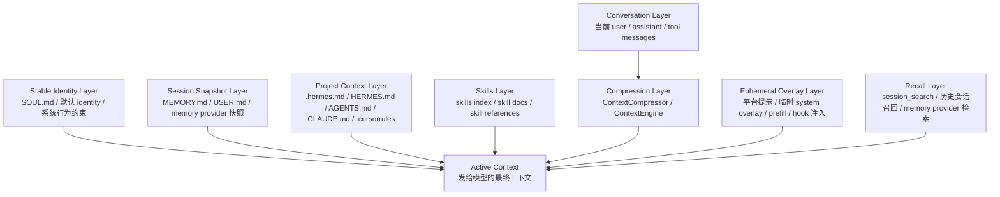
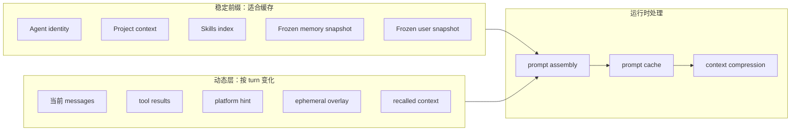
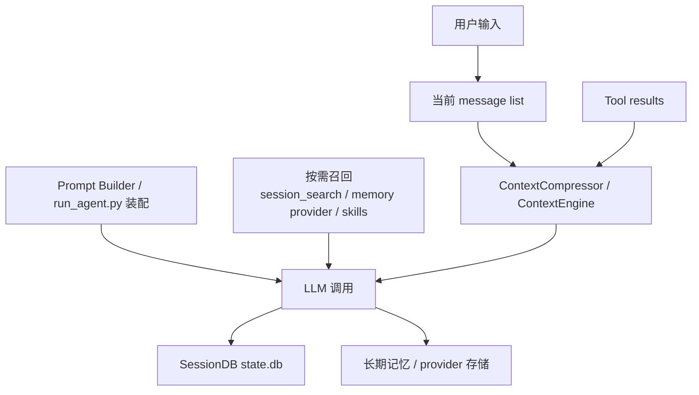
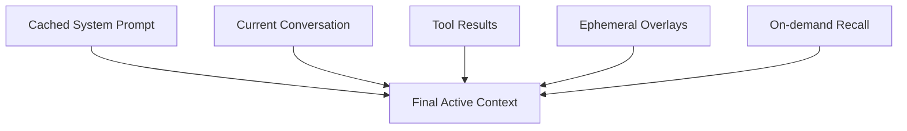

# Hermes Context 分层关系图

这份文档把 Hermes 里的 context 关系用图形化方式拆开，重点回答三个问题：

1. 不同层次的 context 有哪些
2. 它们在运行时如何进入 active context
3. 哪些是稳定前缀，哪些是按需叠加，哪些会被压缩或召回

## 1. 总览图：不同层次的 context

## 2. 运行时装配图：哪些层是稳定前缀，哪些层是动态叠加

可以把它理解成：

- `StablePrefix`：尽量不变，利于 prompt cache
- `DynamicTurn`：这一轮临时加入的内容
- `context compression`：主要作用在会话消息和工具结果，不是简单改写整个系统前缀

## 3. 生命周期图：context 从哪里来，最后沉到哪里去

这里最关键的边界是：

- `state.db` 更像是**历史会话归档层**
- `memory provider` 更像是**长期记忆层**
- `message list` 才是**当前活跃上下文主干**

## 4. 分层细化图：各层的职责边界

```mermaid
flowchart TD
    A[Identity / System Layer]
    A --> A1[定义 Hermes 身份]
    A --> A2[定义工具行为约束]
    A --> A3[定义长期稳定规则]

    B[Session Snapshot Layer]
    B --> B1[会话启动时冻结]
    B --> B2[来自 MEMORY.md / USER.md]
    B --> B3[来自 memory provider 初始快照]

    C[Project Context Layer]
    C --> C1[仓库规则]
    C --> C2[目录约定]
    C --> C3[编码风格 / 工作流约束]

    D[Conversation Layer]
    D --> D1[user 消息]
    D --> D2[assistant 消息]
    D --> D3[tool 调用与返回]

    E[Recall / Overlay Layer]
    E --> E1[session_search 召回]
    E --> E2[provider 检索结果]
    E --> E3[hook 注入]
    E --> E4[平台临时提示]
```

## 5. 最值得记住的一张图

如果只记一个关系，可以记下面这个：

对应一句话总结：

> Hermes 的 active context 不是单一 prompt，而是“稳定系统前缀 + 当前会话消息 + 工具结果 + 临时叠加层 + 按需召回”的组合。

## 6. 和代码文件的对应关系

如果要从图追到代码，建议按这个顺序看：

1. `run_agent.py`
2. `agent/prompt_builder.py`
3. `agent/context_engine.py`
4. `agent/context_compressor.py`
5. `agent/prompt_caching.py`
6. `agent/subdirectory_hints.py`
7. `hermes_state.py`
8. `gateway/run.py`

## 7. 适合继续补图的几个方向

如果后面要继续细化，这几张图最值得再展开：

1. `system prompt` 组装时序图
2. `context compression` 前后消息形态图
3. `session archive` vs `memory provider` 的边界图
4. `subdirectory hints` 如何不改 system prompt、只通过 tool result 提示的流程图
